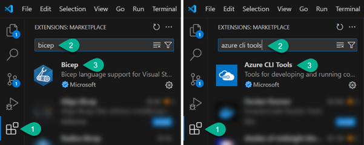
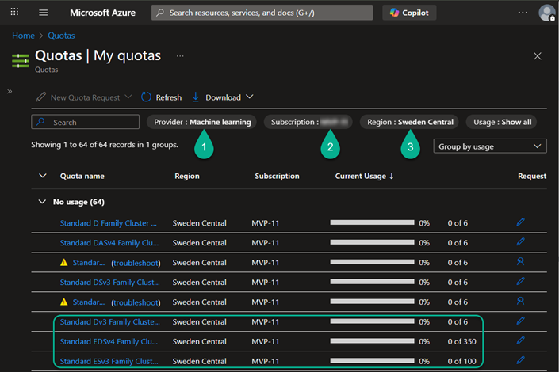

# Nordic Summit 2025 | Full-day workshop
# From Concept to Intelligent Agent: Build AI Agents with Copilot Studio and Azure AI Foundry

*Workshop level: 300*

👨‍💻 **Audience**: Developers, Solution Architects, Power Platform or Azure AI practitioners

🗓️ **Date**: September 19, 2025

📍 **Where**: Clarion Hotel Post, Gothenburg, Sweden

🎟️ ~~[Get a ticket!](https://app.nordicsummit.info/sessions/1e6ce3d6-c11a-f011-998a-6045bddf3f78)~~ **SOLD OUT**

***

This is a hands-on workshop – you’ll actually build an AI-powered agent with Copilot Studio and Azure AI Foundry. We’ll go from idea to working solution, with a bit of magic (and some Bicep) along the way.
To make sure you can follow every step, please set up your laptop and accounts in advance. Think of this as charging your batteries before a road trip 👌 If you skip it, you’ll spend half the workshop watching loading bars while others are already building agents 😉

**1. Bring your laptop**

- Windows 10/11 or macOS – both work.
- Make sure you can install software (yep, that means admin permissions).
- Use a modern browser (Edge or Chrome is safest – Safari sometimes throws tantrums).

**2. Software to install (before the workshop)**

You’ll need a few essentials: 
- Azure CLI ([Windows](https://learn.microsoft.com/en-us/cli/azure/install-azure-cli-windows?view=azure-cli-latest&pivots=msi) | [macOS](https://learn.microsoft.com/en-us/cli/azure/install-azure-cli-macos?view=azure-cli-latest))
- API Playground ([Postman](https://www.postman.com/downloads) | [Insomnia](https://insomnia.rest/))
- Visual Studio Code ([download here](https://code.visualstudio.com/))
- VS Code extensions Bicep
- VS Code extensions Azure CLI Tools

>Why?
>- VS Code + Azure CLI = our Swiss Army knife for deploying things with Bicep.
>- Not into Bicep? No problem. We’ll have a parallel lab where you can provision resources manually in the portal. (Clicking around is fine too — you choose your adventure!)
>

**3. Azure subscription**

This is your playground. Please set it up before the workshop:

- Create an Azure subscription ([free trial here](https://azure.microsoft.com/en-us/pricing/purchase-options/azure-account?icid=azurefreeaccount)). A dedicated trial is best, so you don’t risk nuking something from your corporate environment.
- Make sure you’re Owner at the subscription level ([guide here](https://learn.microsoft.com/en-us/azure/role-based-access-control/role-assignments-portal-subscription-admin)).
- Machine Learning quotas check – important to run compute in AI Foundry.
    - Go to the [Azure Quotas page](https://portal.azure.com/#view/Microsoft_Azure_Capacity/QuotaMenuBlade/~/myQuotas)
    - Choose **Machine Learning** provider → your subscription → **Sweden Central**
    - Make sure you’ve got at least 6 **D-** or **E-series** VM cores available
    - If not, click the little pencil ✏️ and request more
    

>💡 If you get an error:
>- Go to Subscription → Resource Providers
>- Register **Microsoft.Quota** and **Microsoft.Compute**
>- Wait a few minutes, then retry.

**4. Power Platform**

To use Copilot Studio, you’ll need a working Power Platform environment. Without Dataverse + Copilot Studio, you’ll be watching others build agents while your screen stays blank.
- A Microsoft 365 tenant (trial works fine – [sign up here](https://signup.microsoft.com/get-started/signup?products=91dcd8b1-3b1b-444d-9cdb-0bc0da3eb40d&mproducts=CFQ7TTC0LH18:0002&fmproducts=CFQ7TTC0LH18:0002&culture=en-us&country=us&ali=1))
- Power Platform Developer Plan ([get it here](https://www.microsoft.com/en-us/power-platform/products/power-apps))
- Dataverse-enabled environment ([guide](https://learn.microsoft.com/en-us/power-platform/admin/create-environment#create-an-environment-with-a-database))
- Assign yourself the System Administrator role ([guide](https://learn.microsoft.com/en-us/power-platform/admin/assign-security-roles))
- Access to Copilot Studio ([sign-up here](https://learn.microsoft.com/en-us/microsoft-copilot-studio/sign-up-individual))

**5. Skills you’ll find handy**

Don’t panic — you don’t need to be a guru. But it’s nice if you’ve at least seen these:
- Azure basics: resource groups, storage accounts, Key Vault, etc. ([learn here](https://learn.microsoft.com/en-us/training/paths/microsoft-azure-fundamentals-describe-cloud-concepts/))
- Azure CLI: az login, switching subs, running commands ([learn here](https://learn.microsoft.com/en-us/training/modules/create-azure-resources-by-using-azure-cli/))
- Bicep basics: what it is and how to deploy ([intro](https://learn.microsoft.com/en-us/training/modules/implement-bicep/) | [path](https://learn.microsoft.com/en-us/training/paths/fundamentals-bicep/))
- Power Platform basics: solutions, agents ([intro](https://learn.microsoft.com/en-us/training/modules/introduction-solutions/) | [Copilot Studio basics](https://learn.microsoft.com/en-us/training/modules/describe-ai-authoring-experience-power-platform/) | [Copilot Studio Academy](https://microsoft.github.io/agent-academy/))

**Optional warm-up (recommended, ~30 min)**
- **Lab 1: Environment prep**
    - Install AZ CLI + VS Code + extensions
    - Run `az login` and check you can switch subscriptions
    - Run this command to check Cognitive Services usage:
    `az cognitiveservices usage list -l francecentral --output table`
- **Lab 2: Copilot Studio basics**
    - Create a simple Copilot agent, Add a static topic, Test the conversation flow

>🪄 If you do this prep, the workshop will feel smooth and fun. If you don’t… well, you might spend part of it in the “why is my quota erroring” corner. Your call!

**One last thing**

I’ve put together a **short anonymous questionnaire** (just 5 quick questions – takes about 2 minutes).

Why bother? Because your answers give me a “map” of the room before we even start.

- If most people are new to Azure, I’ll spend more time on the basics instead of rushing.
- If everyone’s already deep into Copilot Studio, I can push further into advanced integrations.
- If some of you want governance and IaC while others want quick wins, I can balance the agenda so everyone walks away with something valuable.

It’s completely **anonymous** – no names, no tracking, no grades. Just honest answers that help me tune the workshop for *you* instead of delivering a cookie-cutter session.

👉 [Take the quick questionnaire](https://forms.office.com/e/t4EFYWE0YB)

Your two minutes now = a much better day for you later 🚀

**📬 Got questions before we start?**

Don’t let a missing extension or quota hiccup ruin your workshop experience. If something isn’t working, or you’re not sure whether your setup is correct, reach out. I’ll do my best to help you sort it out before the workshop. It’s way easier to fix things over a quick message than to have you battling Azure live while everyone else is already chatting with their shiny new agent.

Here’s how you can reach me:

💬 LinkedIn: https://www.linkedin.com/in/katerinachernevskaya/

Looking forward to seeing you at the workshop – ready, set, and quota-approved! 😉
