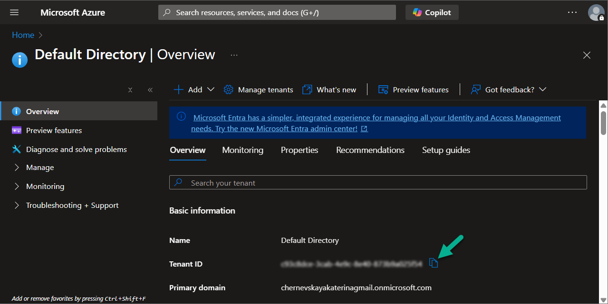
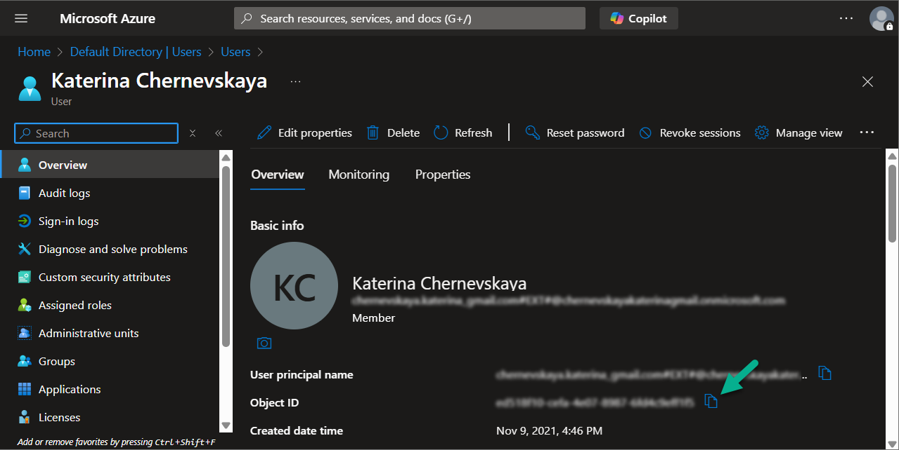
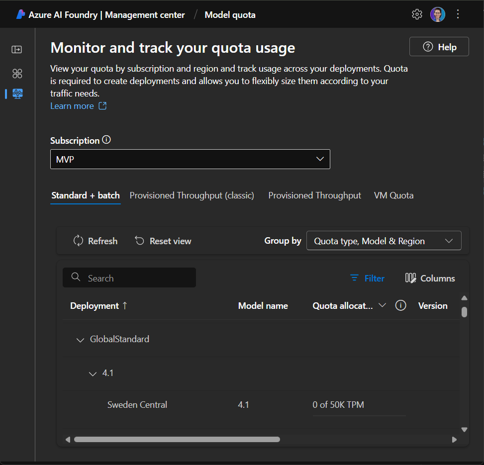
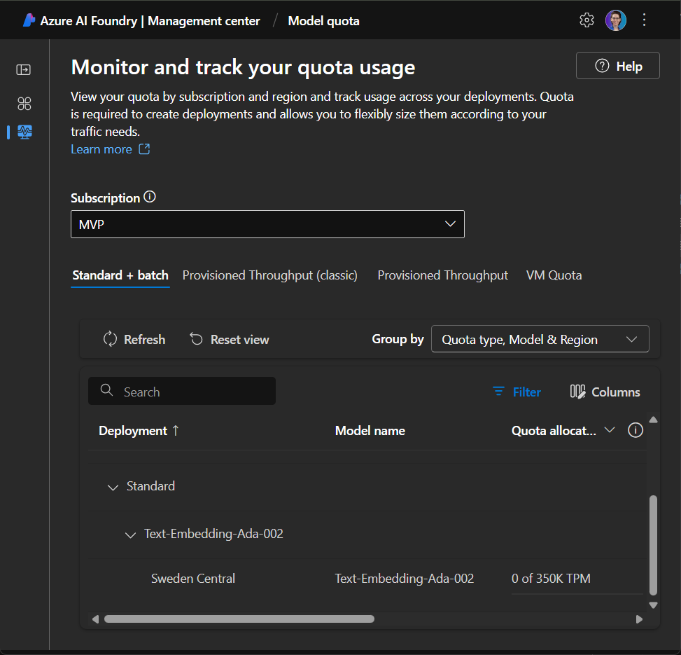
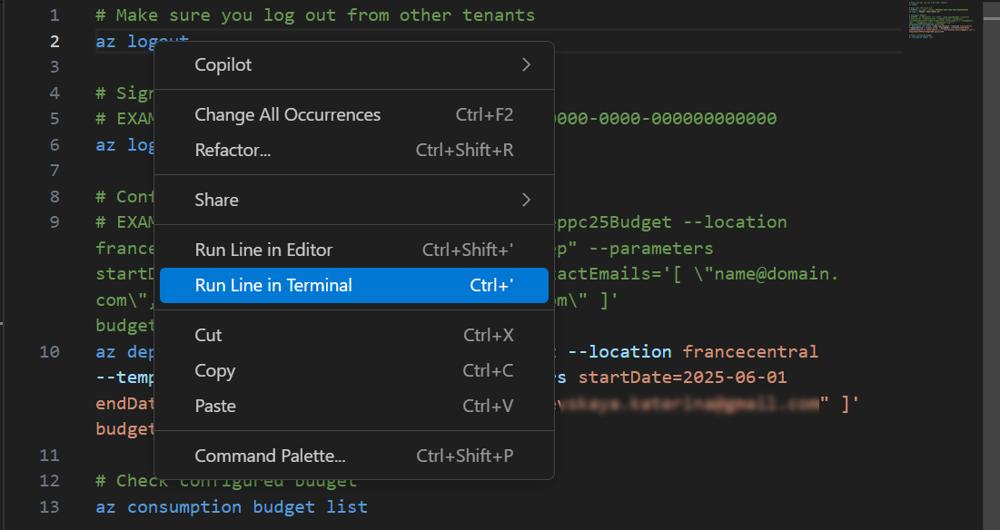
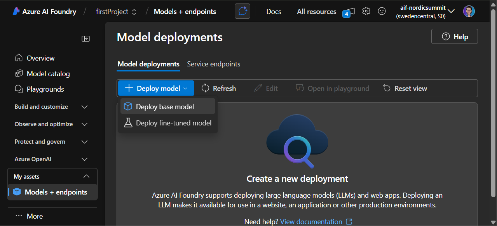

# LAB 6 — Deploy Azure Resources: Bicep or manual

*Provision AI Foundry, Storage, Search, and monitoring via Bicep or manual steps, including quotas and connections.*

## 🤔 Why This Matters

Reliable copilots rest on reliable infrastructure. Declarative IaC reduces drift and speeds rebuilds.

## 🌐 Introduction

You’ll deploy the core estate with Bicep scripts or create resources manually. The focus is on model availability, search, and observability.

## 🎓 Core Concepts Overview

|Concept|Why it matters|
|--|--|
|Infrastructure as Code (Bicep)|Repeatable environments and faster recovery.|
|Model quotas|Prevents runtime failures due to capacity.|
|Managed identities and keys|Secure, auditable access between services.|

## 📄 Documentation and Additional Training Links

- [Azure AI Foundry overview](https://learn.microsoft.com/en-us/azure/ai-foundry/what-is-azure-ai-foundry)
- [Azure AI Foundry Bicep Samples](https://github.com/azure-ai-foundry/foundry-samples/tree/dbc3a7416b3b132943dc0bb83fcd7d2fcf000c8e/samples/microsoft/infrastructure-setup/00-basic)
- [Deploy Azure OpenAI models in Azure AI Foundry](https://learn.microsoft.com/en-us/azure/ai-foundry/how-to/deploy-models-openai)
- [Azure AI Search docs](https://learn.microsoft.com/en-us/azure/search/)
- [Quickstart — Vector search in the Azure portal (Import and vectorize data)](https://learn.microsoft.com/en-us/azure/search/search-get-started-portal-import-vectors)
- [Configure anonymous access for containers and blobs (Storage)](https://learn.microsoft.com/en-us/azure/storage/blobs/anonymous-read-access-configure)
- [Application Insights connection string (reference hub)](https://learn.microsoft.com/en-us/dynamics365/guidance/resources/copilot-studio-appinsights)

## ✅ Prerequisites

- Azure subscription with permissions to deploy resources.
- Quota for GPT‑4.1 and text‑embedding‑ada‑002 or equivalents.
- VS Code and Azure CLI (for Bicep path).

## 🎯 Summary of Targets

- Deploy AI Foundry, Blob Storage, AI Search, Key Vault, and monitoring.
- Connect services with correct identities/keys.
- Capture outputs for later labs.

***

## 🛠️ Instructions

### Option 1 — Bicep

> If you prefer to deploy Azure resources manually - navigate to [Option 2](./README.md#option-2--manually)

*This automated deployment creates and wires the services so they’re ready for ingestion, AI workloads, and monitoring. You can also configure budget limits if supported by your subscription.*

>Note: Deploying via Bicep typically takes ~10–15 minutes.

1. Capture the following values:
   - **Tenant ID** (Azure Portal → Microsoft Entra ID → Overview → Tenant ID).
   
   - Your user **Principal ID** (Microsoft Entra ID → Users → select your user → Object ID).
   
2. Check available quota for Azure OpenAI models:
   - Go to [https://ai.azure.com/managementCenter/quota](https://ai.azure.com/managementCenter/quota).
   - Select your subscription.
   - Turn on Show all quota.
   - Expand **GlobalStandard** and verify available quota for **4.1** in **Sweden Central**. If unavailable, choose an equivalent model and update the Bicep accordingly.
   
   - Check availability of **text‑embedding‑ada‑002** in **GlobalStandard** in **Sweden Central**. 
   
3. Open the repo folder in VS Code (repo that you forked and cloned in the [Lab 0](../lab-00-check-prerequisites/README.md)).
4. Deploy core resources
   - Navigate to the folder **lab-6-deploy-azure-resources**, and open **infra** subfolder.
   - Navigate to [deployment.azcli](./infra/deployment.azcli) file.
   - Open the **Terminal** (**View → Terminal**).
   - In **deployment.azcli**, replace placeholders:
      - `<YOUR_TENANT_ID>` in the first command.
      - `<YOUR_PRINCIPAL_ID>` in the last command.
   - Execute each command sequentially in the integrated terminal.

>Tip: right‑click a line and select **Run Line in Terminal**. Ensure the Azure CLI Tools extension is installed.
>
>

5. Once deployment completes, review and copy the output for reference.

### (HOMEWORK) Configure Budgets

>New subscriptions may need up to 48 hours before Cost Management features like budgets become available ([reference](https://learn.microsoft.com/en-us/azure/cost-management-billing/costs/quick-create-budget-bicep?tabs=CLI#prerequisites)).
>Sponsorship subscriptions can’t create budgets.

Follow [budget.azcli](./infra/budget.azcli) in the infra directory. Run each command sequentially as above.

### Option 2 — Manually

*Create Azure AI Foundry, Azure Blob Storage, and Azure AI Search via the Azure portal following the provided parameters.*

1. Navigate to [portal.azure.com](https://portal.azure.com).
2. Create a **resource group**
   - In the top search bar type `Resource` and select **Resource groups**.
   - Click **Create** and enter the following information:
      - Select subscription.
      - Enter **resource group name**: `nordic-summit-rg`.
      - Select **region**: `Sweden Central`.
   - Click **Review + create** and click **Create** on the next screen.
3. Create **Azure AI Foundry**.
   - In the top search bar type `Foundry` and select **Azure AI Foundry**.
   - Navigate to **Azure AI Foundry** section, and click **Create**.
   - Enter the following information:
      - Select subscription.
      - Select **resource group**: `nordic-summit-rg`.
      - Enter **name**: `aif-nordicsummit`.
      - Select **Location**: `Sweden Central`.
   - Click **Next** till **Review + submit** page.
   - Check if everything is correct and click **Create**.
   - Once the resource created click **Go to resource** and on the opened page click **Go to Azure AI Foundry portal**.
   - Navigate to **Models + endpoints** and select **Deploy base model** under the **Deploy model** drop down.
   
   - Select `gpt-4.1` model and click **Confirm**.
   - Click **Customize** and update the **Tokens per Minute Rate Limit** if required.
   - Click **Deploy**.
   - Go back to **Models + endpoints** page and repeat steps to deploy `text-embedding-ada-002 model`.
4. Create **Azure Blob Storage** recourse:
   - In the top search bar type `storage` and select **Storage accounts** resource.
   - Click **Create** and enter the following information:
      - Select subscription.
      - Select **resource group**: `nordic-summit-rg`.
      - Enter **resource name**: `stnordicsummit`.
      - Select **Location**: `Sweden Central`.
      - Select P**referred storage type**: `Azure Blob Storage or Azure Data Lake Storage Gen 2`.
      - Keep **Performance** `Standard`.
      - For **Redundancy** select `LRS`.
   - Click **Review + create** and click **Create** on the next screen.
   - When the recourse will be deployed - click **Go to resource**.
   - *(Optional)* On the **Overview** page in the **Properties** section for the **Blob anonymous access** click **Disable**. On the opened page enable **Allow Blob anonymous access** and click **Save**.
   - Navigate to **Containers** and click **Add container**.
   - Enter **Name**: `ns-container`.
   - *(Optional)* Select **Anonymous access level** - `Container` and click **Create**.
5. Create **Azure AI Search** recourse:
   - In the top search bar type `search` and select **AI Search** resource.
   - Click Create and fill the form:
      - Select subscription.
      - Select **resource group**: `nordic-summit-rg`.
      - Enter **resource name**: `ais-nordicsummit`.
      - Select **Location**: `Sweden Central`.
      - For the **Price tier** select **Change Pricing Tier** and select `Free` or 
      `Basic`.
   - Click **Review + create** and click **Create** on the next screen

***

**🏅 Congratulations! You’ve completed the Lab 6!**

## 📑 Summary of Learnings

- Infra first, features second.
- IaC is your documentation and rollback plan.

## 🔑 Golden rules

- Treat quotas as preflight checks.
- Prefer managed identity over secrets when possible.
- Tag resources for ownership and cost.
- Keep outputs handy for downstream wiring.
- Monitor from day one.