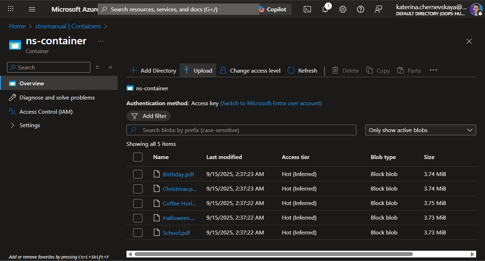
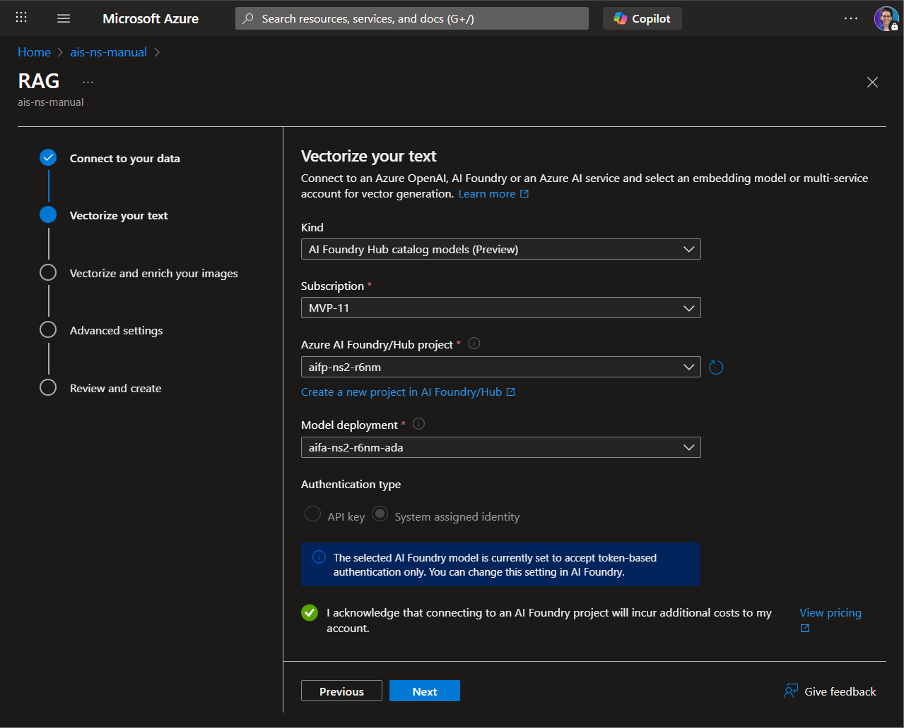

# LAB 7 — Upload documents and configure index

*Land PDFs in Blob Storage and build a vector‑enabled Search index with a scheduled indexer.*

## 🤔 Why This Matters

Grounding depends on clean, discoverable content. Search quality starts at ingestion.

## 🌐 Introduction

You’ll upload files to Storage, then use Import and vectorize data to configure data source, indexer, index, and embedding via AI Foundry.

## 🎓 Core Concepts Overview

|Concept|Why it matters|
|--|--|
|Data source / indexer / index|Clear separation makes pipelines maintainable.|
|Vectorization|Powers semantic and hybrid retrieval for better answers.|
|Deletion tracking|Keeps the index in sync with storage reality.|
|Index fields hygiene|Metadata improves traceability.|

## 📄 Documentation and Additional Training Links

- [Quickstart — Vector search in the Azure portal](https://learn.microsoft.com/en-us/azure/search/search-get-started-portal-import-vectors)
- [Configure a vectorizer](https://learn.microsoft.com/en-us/azure/search/vector-search-how-to-configure-vectorizer)
- [Integrated vectorization with Azure AI Foundry models](https://learn.microsoft.com/en-us/azure/search/vector-search-integrated-vectorization-ai-studio)
- [Vector search overview](https://learn.microsoft.com/en-us/azure/search/vector-search-overview)

## ✅ Prerequisites

- Storage account and container from [Lab 6](../lab-6-deploy-azure-resources/README.md).
- AI Search service with available capacity.
- AI Foundry project with an embeddings deployment.

## 🎯 Summary of Targets

- Upload PDFs to the designated container.
- Create a vectorized index with daily indexing.
- Prefix object names consistently (e.g., ns-vector).

***

## 🛠️ Instructions

**Upload documents**
1. Open the Storage account created previously.
2. Go to **Containers**, open the created container (e.g., `ns-container`).
3. Select *Upload*.
4. Add the files from [sample-docs](../../sample-docs/).
5. Select **Upload** to confirm.
6. Verify the files appear in the container.

**Configure search index**
1. Open the **Azure AI Search** resource created in the previous lab.
2. Select **Import and vectorize data**.
3. Select **Azure Blob Storage** as the data source.
4. Select the **RAG** scenario.
5. Configure the data connection: **subscription**, **storage account**, **container**; **Parsing mode** = `Default`; enable **Deletion tracking**; Authenticate using **managed identity**.

6. Select **Next**.
7. Vectorization:
    - **Kind**: `AI Foundry Hub catalog models (Preview)`.
    - **Subscription**: your subscription.
    - **Azure AI Foundry/Hub project**: the project created earlier.
    - **Model deployment**: choose the ada embedding model.
    - **Acknowledge cost notice**.
    
8. Select **Next** for **Advanced settings**:
    - In Index fields, select **Preview and edit** and add `metadata_storage_path`.
    - Set **Indexer schedule** = `Daily`.
9. Select **Next**.
10. On **Review and create**, set **Object name prefix** to `ns-vector`.
11. Select **Create**.

**Verify**
1. After the indexer’s first run, confirm **Success** and no warnings.
2. Under Search management, open **Data sources** and verify the data source exists.

>If the indexer fails with a Web API error: grant the **Search service identity** the **Cognitive Services User** role on the **Azure AI Foundry resource** (IAM → Add role assignment → assign to the Search managed identity).

***

**🏅 Congratulations! You’ve completed the Lab 7!**

## 📑 Summary of Learnings

- Good retrieval is built, not wished into existence.
- Schedules and metadata prevent silent drift.

## 🔑 Golden rules

- Keep containers and prefixes consistent.
- Turn on deletion tracking early.
- Add fields you’ll actually use for filtering and citations.
- Monitor indexer runs; failing silently is not a feature.
- Document your embedding model choice.