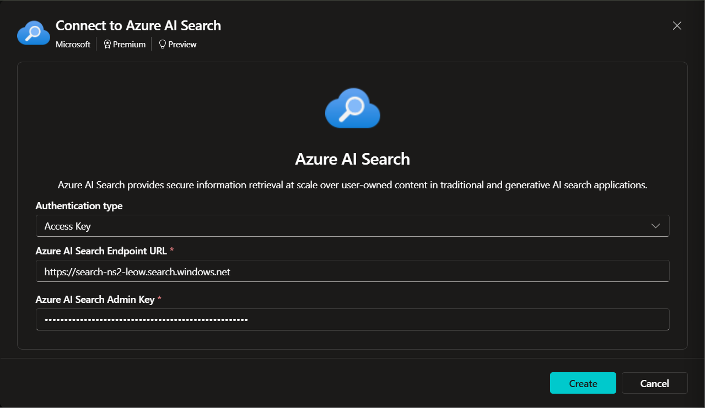
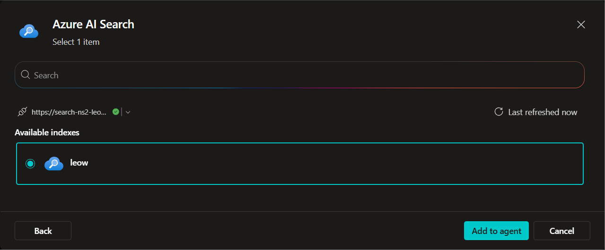
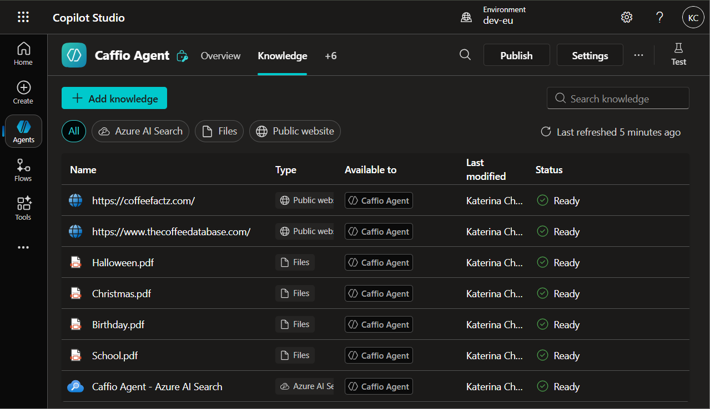
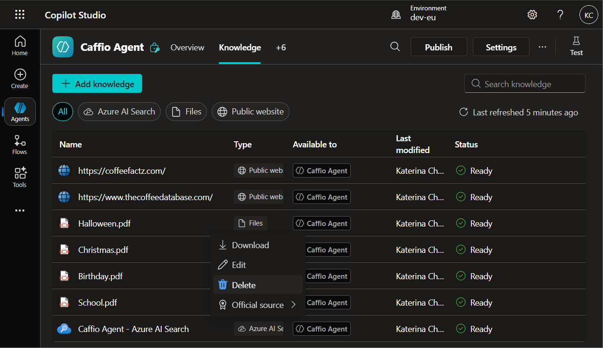
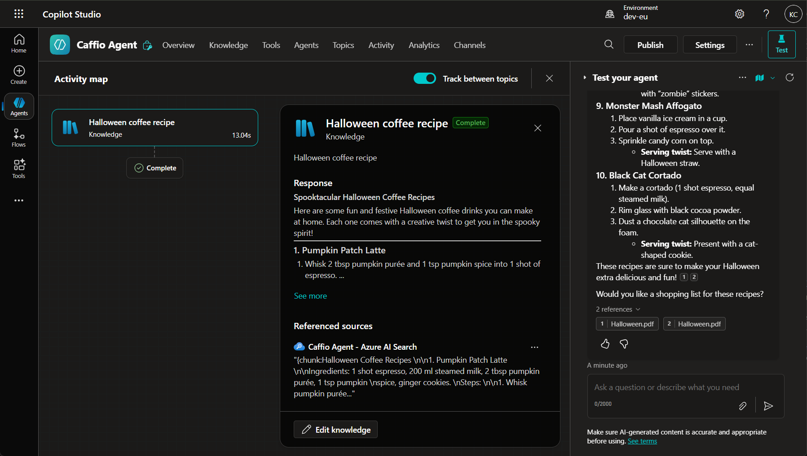

# LAB 8 — Connect AI Search with Copilot Studio

*Add the AI Search index as a knowledge source using an access key and validate grounded answers in activity maps.*

## 🤔 Why This Matters

Search without grounding inside the agent is just potential. Connection turns it into value.

## 🌐 Introduction

You’ll add AI Search as Knowledge, create a new connection with Access Key, pick the target index, and verify citations.

##  🎓 Core Concepts Overview

|Concept|Why it matters|
|--|--|
|Knowledge provider connection|Bridges retrieval to generation.|
|Admin keys and endpoints|Correct wiring avoids 401s and empty answers.|
|Activity map tracing|Shows which chunks fed the response.|
|Knowledge curation|Avoids duplicate or conflicting sources.|

## 📄 Documentation and Additional Training Links

- [Add Azure AI Search as a knowledge source](https://learn.microsoft.com/en-us/microsoft-copilot-studio/knowledge-azure-ai-search)
- [Knowledge sources overview](https://learn.microsoft.com/en-us/microsoft-copilot-studio/knowledge-copilot-studio)

## ✅ Prerequisites

- AI Search service and index from [Lab 7](../lab-7-configure-index/README.md).
- Admin key and endpoint URL.
- Existing agent in Copilot Studio.

## 🎯 Summary of Targets

- Create a new AI Search connection with Access Key.
- Add the vectorized index to the agent and confirm Ready state.
- Remove overlapping PDFs to avoid duplicate content paths.

***

## 🛠️ Instructions

1. Open your Agent.
2. Go to **Knowledge** and select **Add knowledge**.
3. Choose **Azure AI Search**.
4. Select **Create new connection** and complete:
   - **Authentication type**: `Access Key`.
   - **Endpoint URL**: `https://<AI_SEARCH_NAME>.search.windows.net`
   - **Admin Key**: paste the `Primary Admin Key` from your Search resource (Settings → Keys).
   
5. Select **Create**.
6. Confirm the green status indicator.
7. Select the index created previously and choose **Add to agent**.

8. Verify the new knowledge shows **Ready**.

9. Since the same dataset exists in Copilot Studio, delete the PDF knowledge sources to keep only **Web** and **AI Search** (three dots → Delete).

10. **Test** with: `Please tell me a good Halloween recipe`.
11. In Activity, confirm the answer is based on **AI Search chunks**.

>Note: Citations from this source may be terse. Allocate time to decide how you’ll present them to users.

***

**🏅 Congratulations! You’ve completed the Lab 8!**

## 📑 Summary of Learnings

- Proper connections make retrieval visible and trustworthy.
- Less is more: curate overlapping sources.

## 🔑 Golden rules

- Store keys securely and rotate when needed.
- Keep one authoritative path per content set.
- Validate chunk‑level citations in tests.
- Remove stale or redundant sources.
- Re‑test after any index changes.