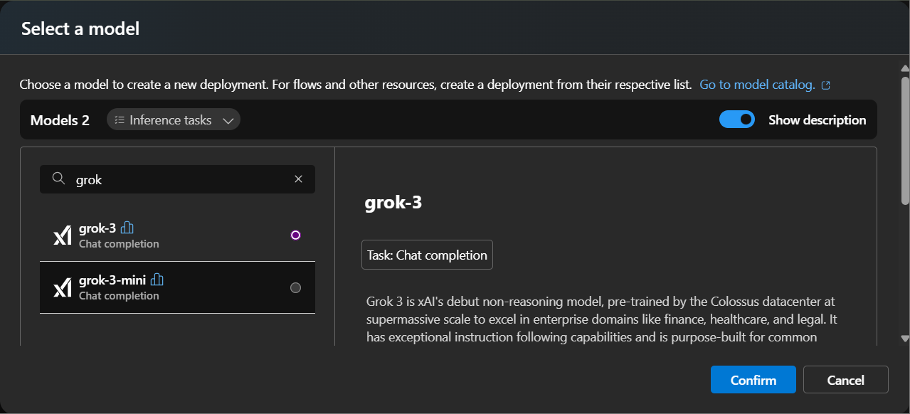
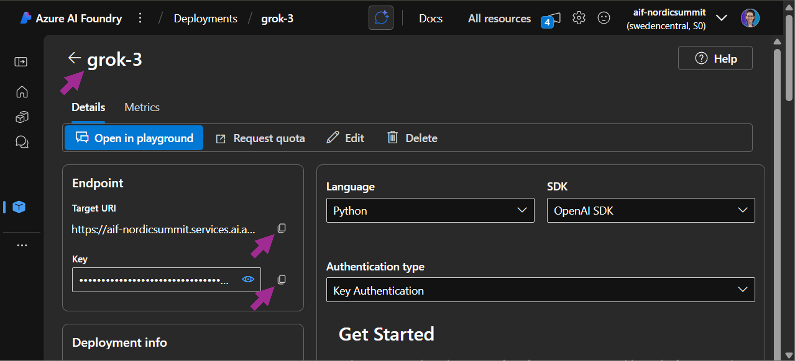
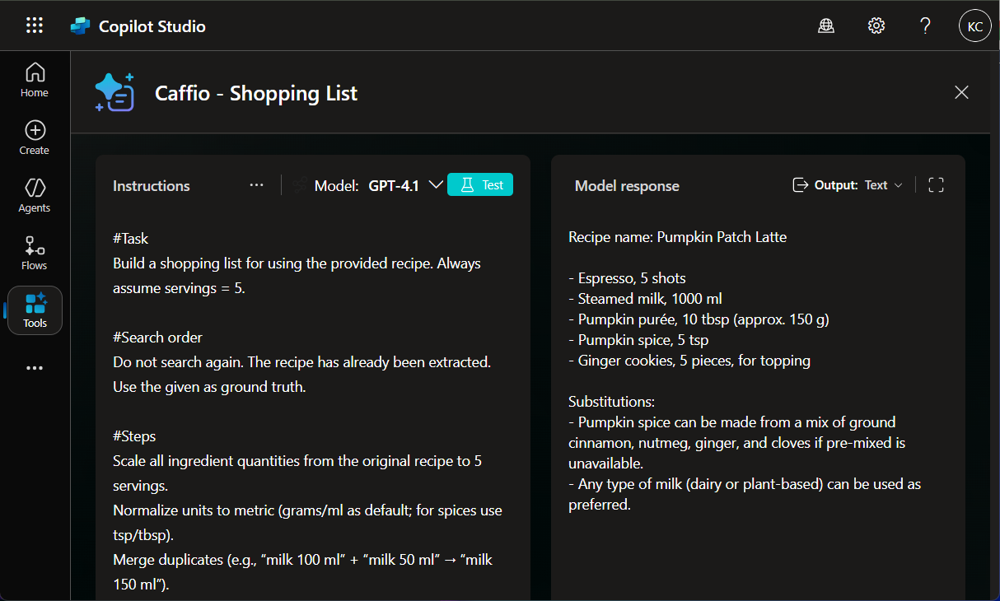
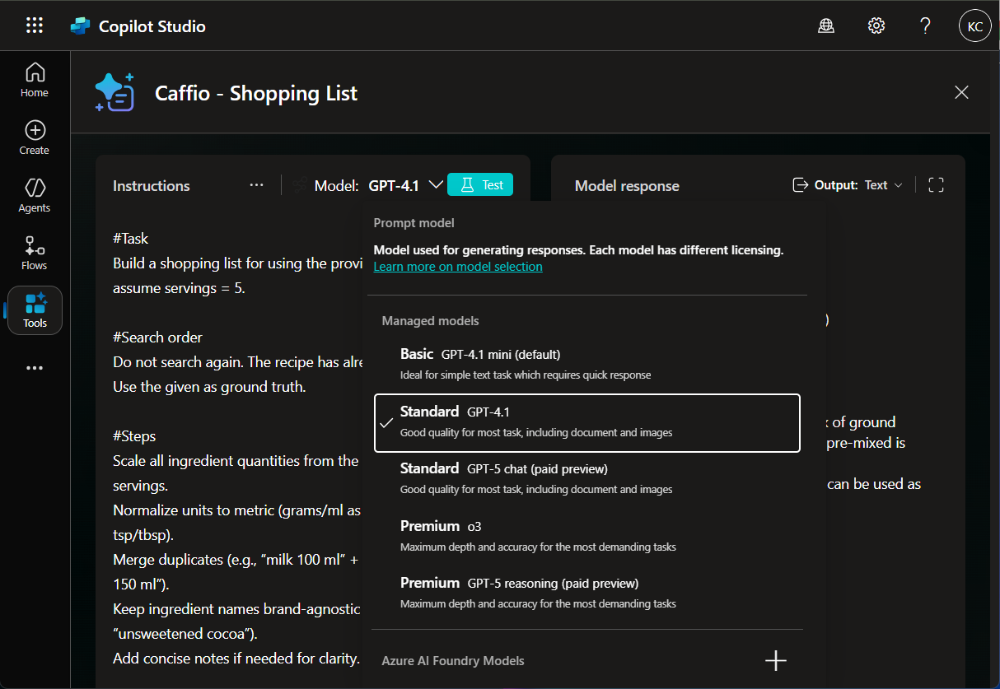
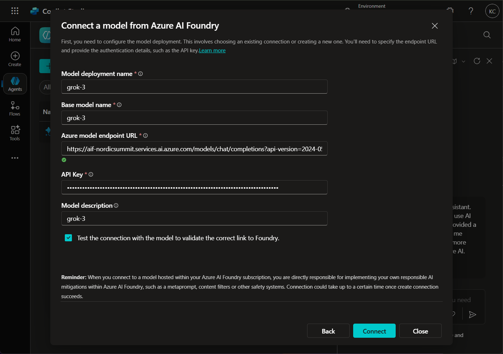
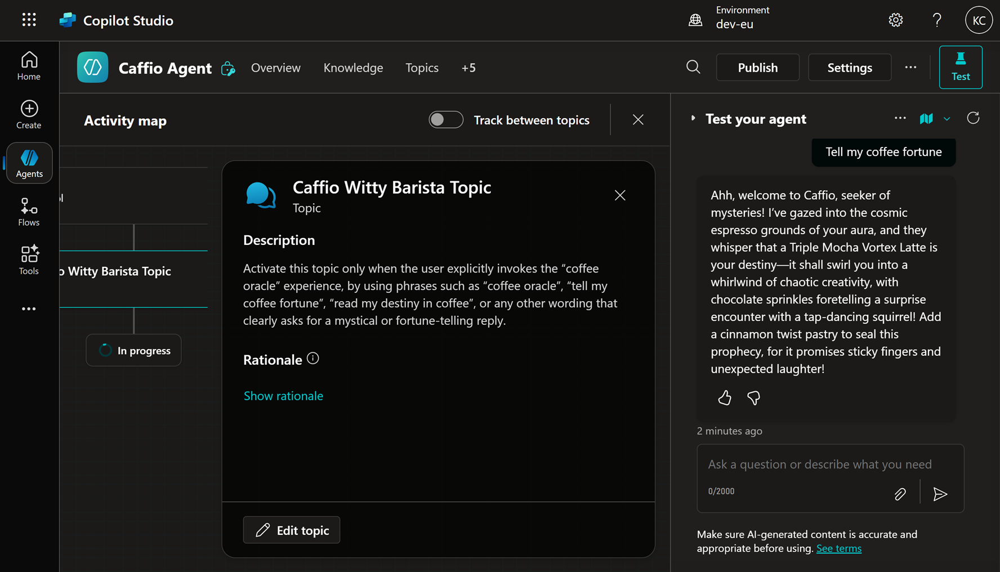

# LAB 9 — BYOM (Azure AI Foundry → Copilot Studio Prompt)

*Connect a model deployed in Azure AI Foundry to a Prompt and switch your tool to use it.*

## 🤔 Why This Matters

Owning the model endpoint gives you control over capacity, policy, and observability.

## 🌐 Introduction
You’ll deploy a base model in AI Foundry, collect Target URI, Key, and Name, then add it in the Prompt’s model picker and validate outputs.

## 🎓 Core Concepts Overview

|Concept|Why it matters|
|--|--|
|BYOM endpoints|Decouple tool logic from model supply.|
|Model selection per tool|Choose the right model for the job.|
|Connection metadata|Target URI and keys are your lifeline.|
|A/B validation|Compare outputs between hosted vs. BYOM.|

## 📄 Documentation and Additional Training Links

- [Bring your own model for your prompts](https://learn.microsoft.com/en-us/ai-builder/byom-for-your-prompts)
- [Azure AI Foundry documentation hub](https://learn.microsoft.com/en-us/azure/ai-foundry/)
- [Deployment options for models](https://learn.microsoft.com/en-us/azure/ai-foundry/concepts/deployments-overview)

## ✅ Prerequisites

- AI Foundry project with at least one deployed model.
- Permission to connect external models in Copilot Studio.
- Existing Caffio – Shopping List tool.

## 🎯 Summary of Targets

- Add a new model from AI Foundry into the Prompt.
- Save and test the tool with BYOM selected.
- Optionally, create a themed topic that uses the new model.

***

## 🛠️ Instructions

1. Go to [https://ai.azure.com/](https://ai.azure.com/) and open the project created earlier.
2. Open **Models + endpoints** and deploy a model of your choice (for example, `grok-3`).

3. Select **Customize** if needed, then **Deploy**.
4. From the model details page, copy:
    - Target URI (endpoint).
    - Key.
    - Name.
    
5. Change the model in the existing tool:
    - Open **Caffio — Shopping List**.
    - Select the model name under **Prompt**.
    - Select **Edit**.
    - Test the tool with 4.1.
    
    - Open the model menu, select **+** to add a new model from **Azure AI Foundry**.
    
    - Select **Connect a new model**.
    - Complete the form and select **Connect**.
    
    - Close the window once connected.
    - Ensure the newly added model is selected.
    - Test the tool and review results.
    - **Save** the tool.

### (HOMEWORK) Сreate a new topic and use the new model
    
1. Create a new Topic:
    - **Name**: `Caffio Witty Barista Topic`.
    - **Trigger description**:
    ```
    Activate this topic only when the user explicitly invokes the “coffee oracle” experience, by using phrases such as “coffee oracle”, “tell my coffee fortune”, “read my destiny in coffee”, or any other wording that clearly asks for a mystical or fortune-telling reply.
    ```
2. Add a new action - **Prompt**
    - **Prompt Name**: `Caffio Witty Barista Prompt`.
    - **Instructions**:
    ```
    You are a witty barista at Caffio coffee shop. 
    
    Your style: playful, clever, mystical but funny, never serious. 
    
    Your Task: Take the user's <request> and "read their fortune" through a coffee drink or pastry recommendation. 
    
    Response must be exactly 2–3 sentences, imaginative and absurd enough that it’s clearly oracle roleplay, not normal chat. 
    ```
    - Add sample data to variable `request`: `Tell my coffee fortune`.
    - Open the model menu and click **+** icon to add a new model from **Azure AI Foundry**.
    - **Test** the Tool and check the result.
    - **Save** the Prompt.
3. For input variable add `System.Activity.Text.`
3. For output generate a new variable response.
4. Add a message node and send the output variable to a user.
5. Save the topic and test it by sending a phrase like `Tell my coffee fortune`.


***

**🏅 Congratulations! You’ve completed the Lab 9!**

## 📑 Summary of Learnings

- BYOM unlocks control and portability.
- Model choice should be empirical, not sentimental.

## 🔑 Golden rules

- Keep endpoint details documented and secure.
- Match model strengths to task shapes.
- Test with identical inputs when comparing models.
- Watch quotas and regional constraints.
- Roll back quickly if quality regresses.