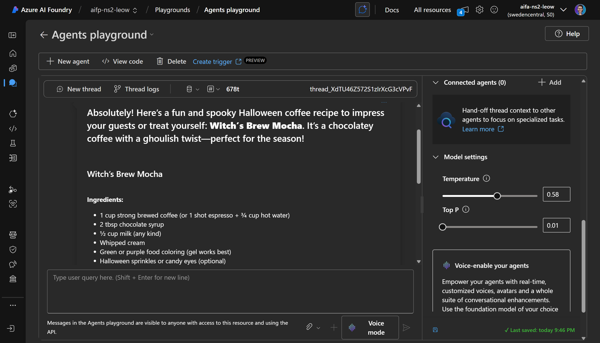
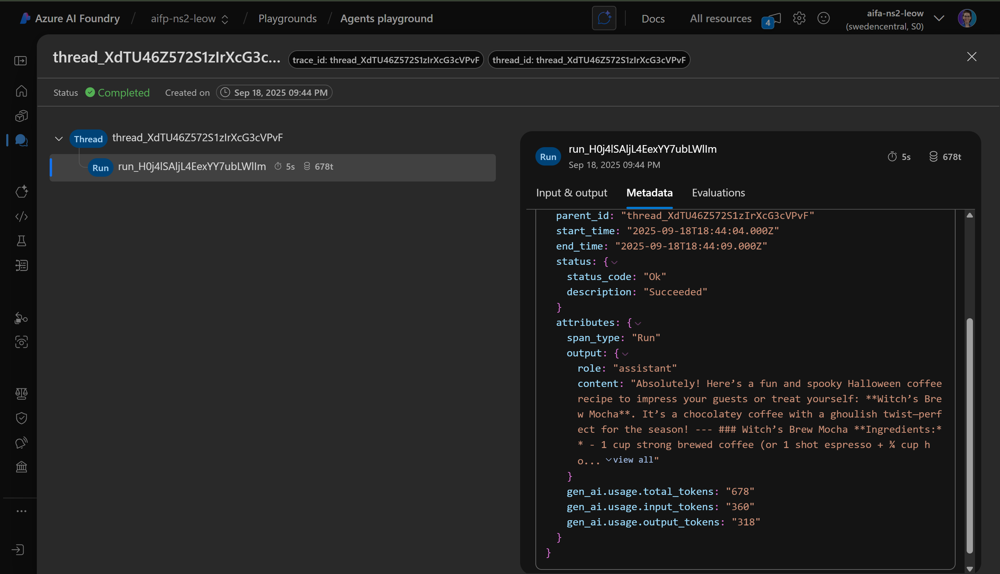
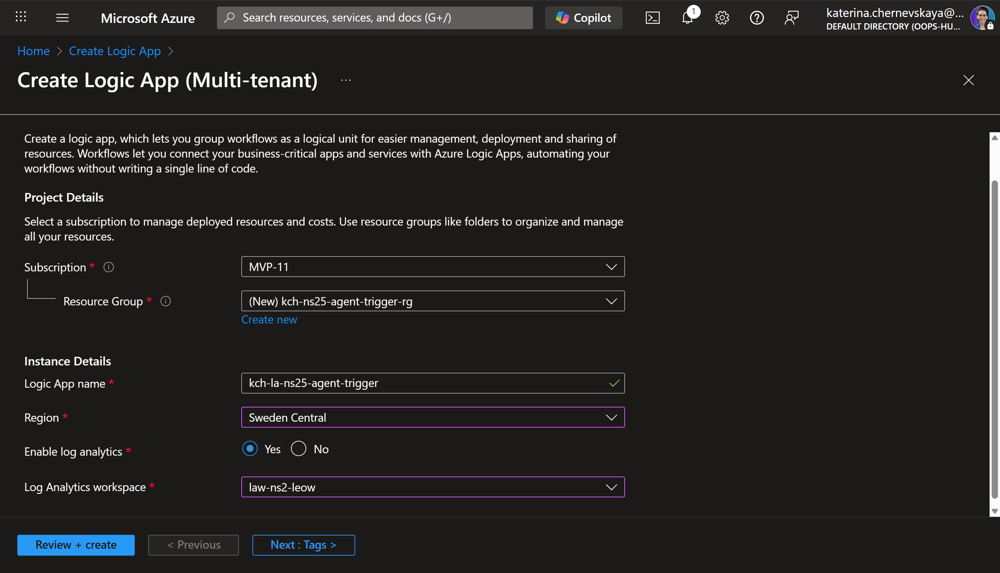
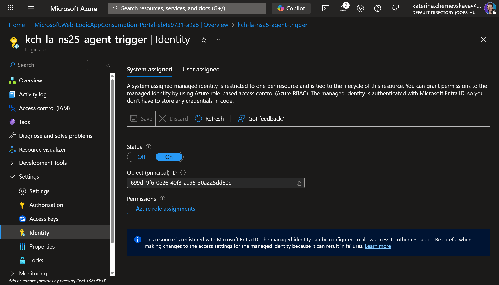
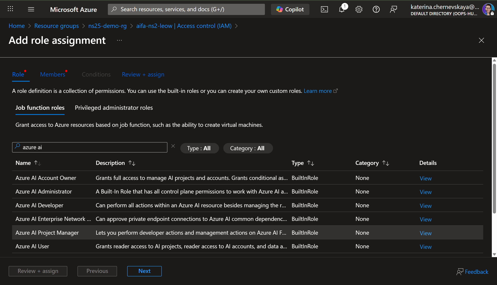
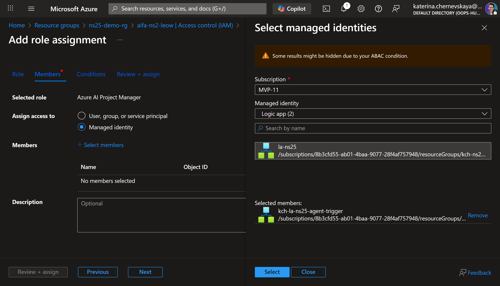
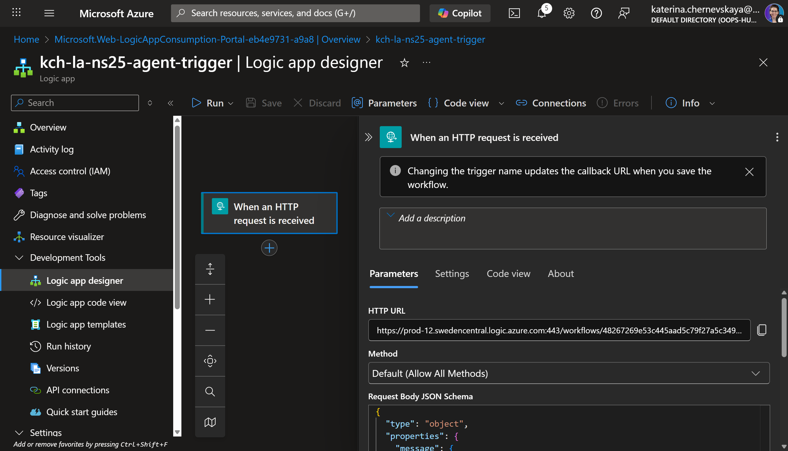
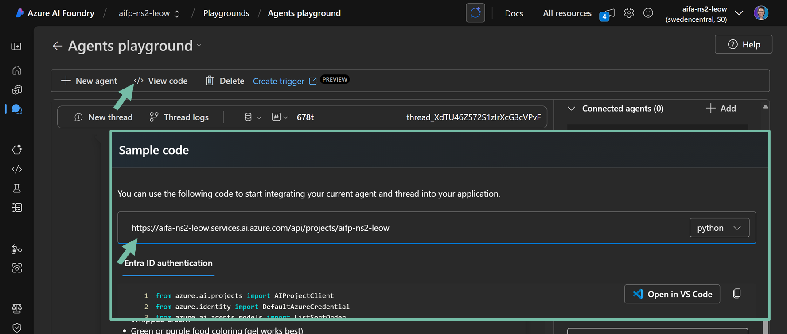
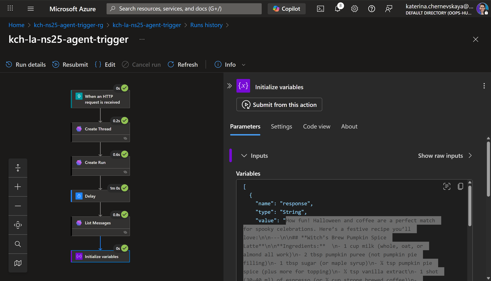
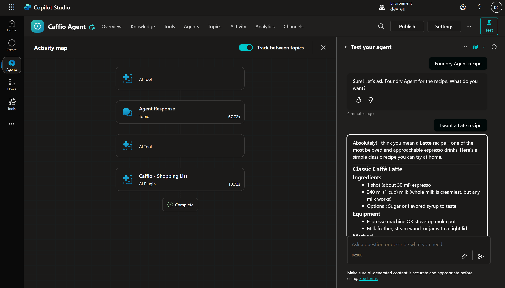

# LAB 11 — AI Foundry Agent

## 🤔 Why This Matters

AI Foundry agents let you separate conversational brains from the front‑end experience. Pairing an AI Foundry agent with a lightweight trigger in Logic Apps gives you scalable, event‑driven execution that your Copilot Studio agent can call on demand. The result: clearer responsibility boundaries, better observability, and easier swaps or upgrades of the underlying model.

## 🌐 Introduction

In this lab, you’ll stand up a focused AI Foundry agent (Caffio Foundry Agent), validate its behavior in the Playground, inspect Thread logs for tokens and metadata, expose an HTTP entry point via Logic Apps (Consumption), and then call that flow from a Copilot Studio topic. You’ll use managed identity and a least‑privilege role to keep the integration secure while polling for the agent’s response and returning it to Copilot Studio.

## 🎓 Core Concepts Overview

|Concept|Why it matters|
|--|--|
|AI Foundry agent|Encapsulates instructions, tools, and model choice behind a stable API.|
|Thread and Run|A thread represents a conversation; a run executes the agent against that thread. Enables resume and history.|
|Playground + Thread logs|Safe space to tune behavior and see token/latency/metadata per session.|
|Logic Apps trigger (HTTP)|Turns the agent into a callable endpoint with schema validation and retries.|
|Managed Identity + RBAC|Keyless auth; the Logic App gets the Azure AI Project Manager role to call the project.|
|Polling pattern|Long‑running agent calls require polling or callbacks. Delay + List Messages is the simplest pattern.|
|Copilot Studio HTTP node|Bridges Copilot topic flows to external systems and returns structured JSON to variables.|

## 📄 Documentation and Additional Training Links

- [Trigger an agent using Logic Apps (Preview)](https://learn.microsoft.com/en-us/azure/ai-foundry/agents/how-to/triggers)

## ✅ Prerequisites

- Access to an Azure AI Foundry project with permission to create agents.
- Permission to create Logic Apps (Consumption) and enable System‑assigned Managed Identity.
- A Log Analytics workspace (optional but recommended) for Logic Apps diagnostics.
- A working Copilot Studio agent and permission to add Topics and HTTP Request nodes.
- A REST client (Postman/Insomnia) for quick endpoint testing.

## 🎯 Summary of Targets

By the end of this lab you will:
- Create and configure the Caffio Foundry Agent with clear scope, tone, rules, and tasks.
- Validate behavior in Playground and review Thread logs for token usage and metadata.
- Deploy a Logic App with an HTTP trigger that creates a Thread, starts a Run, waits, and reads the latest Message.
- Secure the Logic App using Managed Identity and grant it Azure AI Project Manager on the AI Foundry project.
- Return a structured JSON payload { response, thread_id } to callers.
- Call the Logic App from a Copilot Studio topic via HTTP Request and display the agent’s answer to the user.

***

## 🛠️ Instructions

### Build Agent

1. Navigate to [Azure AI Foundry](https://ai.azure.com/) and select your **default** project.
2. Go to **Agents**.
3. Create the first Agent.
4. Rename the Agent to `Caffio Foundry Agent` and add the following **Instructions**:
```
#Role & Scope
- Act as a friendly coffee expert and recipe assistant.
- Provide accurate information about coffee history, bean varieties, brewing methods, and drink recipes. 

#Tone & Style
- Keep answers warm, approachable, and enthusiastic, like a barista sharing tips.
- Avoid technical jargon unless explicitly asked for deeper detail.
- Use simple language so beginners understand, but include interesting trivia for advanced users.

#Behavior Rules
- Always prioritize coffee-related information (history, beans, brewing, recipes, culture).
- For recipes or drink recommendations:
    - Make it clear to the user which source was used.
    - Select no more than 1–2 recipes that fit the request.
    - Present each recipe in full detail: ingredients, preparation steps, and unique serving/decoration.
    - Never output long truncated lists. Maximum 2 recipe per answer.
- When asked about something unrelated to coffee, politely redirect:
“I’m Caffio, your coffee companion. I can help with beans, brewing, and coffee culture!”
- For recipes, present steps in a clear, ordered list.
- Keep them short and actionable.
- When comparing items (e.g. Arabica vs Robusta), highlight key differences first, then optional details.
- Offer fun facts occasionally to make the conversation engaging.
- Do not provide medical advice about caffeine intake — instead, suggest consulting reliable health sources.

#Tasks
- Summarize results clearly instead of dumping raw text.
- Provide variations when relevant (e.g. different brewing methods for the same drink).
- If asked for something unavailable, acknowledge limits and suggest the closest useful info.
```
5. Test the Agent in the Playground by selecting the button **Try in Playground**.
> You can adjust Temperature and set TopP to 0.



6. Check **Thread logs** for more information about metadata, tokens, etc. per session.


### Create Agent trigger

1. Click **Create trigger** in the Agent Playground.
2. Select **Consumption** plan of Azure Logic Apps resource.
3. Complete the form:
   - Select your Azure subscription.
   - Create a new resource group.
   - Provide the name for Azure Logic Apps resource (e.g., `la-nordicsummit-agent`).
   - Select `Sweden Central` region.
   - Enable **Log Analytics** and select a resource created before.
   
4. Create the resource.
5. Once the resource is deployed, click **Go to resource**.
6. Under **Settings** navigate to **Identity** and enable **System assigned**.

7. Navigate to Azure AI Foundry resource on the Azure portal and select access conctol (IAM)**.
8. Click **Add** -> **Add role assignment**.
9. Find and select **Azure AI Project Manager** role.

10. On the **Members** page select **Managed identity** and click on **Select members**.
11. Select the Logic Apps managed identity and click **Select**

12. Click **Review + assign** twice and chceck that assignmnet completed.

### Craft Azure Logic App flow

1. Go back to the Azure Logic App resource and select **Logic app designer** under **Development Tools**.
2. Click **Add a trigger** and select **When an HTTP request is received**.
3. Add **Request body JSON schema**:
```
{
  "type": "object",
  "properties": {
    "message": {
      "type": "string"
    },
    "thread_id": {
      "type": "string"
    }
  }
}
```
4. Save flow (this ill generate the HTTP request URL).

5. Add new action **Create Thread** and create connection:
   - **Connection Name**: `la-agenttrigger`.
   - **Azure AI Project Endpoint**: Azure AI Foundry Project URL (the format is `http://<aiservicename>.services.ai.azure.com/api/projects/<project name>`).
   
6. Click **Create new**.
7. Add a new action **Create Run** and add parameters:
   - **The ID of the thread to create a message for**: `id` from the previous action (Create Thread).
   - **The ID of the run**: the Agent ID (you can take this value from the Playground page).
   - Add additional parameter - **Additional_messages**. Switch to **entire array** and add the following:
   ```
    [
        {
            "role": "user",
            "content": @{triggerBody()?['message']}
        }
    ]
   ```
8. Add a new action **Delay** for 60 seconds.
9. Add a new action **List Messages** and add a parameter:
   - **The ID of the thread to create a message for**: `id` from the action **Create Thread**.
10. Initialize a new variable:
   - **Type**: `string`.
   - **Value**: `body('List_Messages')['data'][0]['content'][0]['text']['value']`.
11. Save the flow.

### Test in Postman (or Insomnia)

1. Create the Request:
   - **Method**: `POST`.
   - **URI**: Get the URI from the trigget of Logic App flow.
   - **Body**:
   ```
   {
      "message": "I need a recipe for Halloween please"
   }
   ```
2. Run this request.
3. Check that the response is `202 Accepted`.
4. Go back to Logic App resource and open **Overview** page.
5. Refresh the run history and open the latest run.
6. Wait the completion of the run and open the last action.
7. Check that the variable received the Agent's response.


### Connect Azure Logic App to Copilot Studio Agent

1. Add the last action to the flow - **Response**.
2. Add the following to the **Body**:
```
{
  "response": "@{variables('response')}",
  "thread_id": "@{body('Create_Thread')['id']}"
}
```
3. Open the Copilot Studio Agent and create a new topic.
4. Set th following text for **Trigger**:
```
Launch if a user ask for Foundry Agent recipe.
```
5. Add a new node **Ask a question**:
   - **Message**: Sure! Let's ask Foundry Agent for the recipe. What do you want?.
   - **Identify**: `User's entire response'.
   - **Save user response as**: create a new variable `user_input`.
6. Add a new node **HTTP Request**:
   - **URL**: Copy from the trigger of the Logic App flow.
   - **Method**: `POST`.
   - Edit **Headers and body**:
      - For **Body** select **JSON content**.
      - Swith to **Edit formula**.
      - Add the following:
      ```
      {
         message: Topic.user_input
      }
      ```
      - **Request timeout (milliseconds)**: `70000`.
   - **Response data type**: `From sample data`.
   - Click **Get schema from sample JSON** and add the following:
   ```
   {
      "response": "string",
      "thread_id": "string"
   }
   ```
   - **Save response as**: create a new variable `agent_response`.
7. Add a new node **Message** and send to a user agent's response (variable `agent_response.response`).
8. Name the topic **Agent Response**.
9. Save the topic.
10. Test the topic.


***

## 🧾 Summary

You decoupled conversation orchestration from your Copilot. The AI Foundry agent now runs behind a robust, observable Logic App with RBAC via Managed Identity, and Copilot Studio consumes it through a clean HTTP contract. That architecture makes model swaps, throttling strategies, and monitoring upgrades far less painful.

## 🔑 Golden rules

- Prefer Managed Identity over static keys; grant the smallest role that works.
- Always return structured JSON and capture thread_id for continuity.
- Avoid blind waits; poll for state or set a strict timeout.
- Log correlations across Foundry, Logic Apps, and Copilot telemetry.
- Keep agent instructions concise and testable; Playground first, integration second.