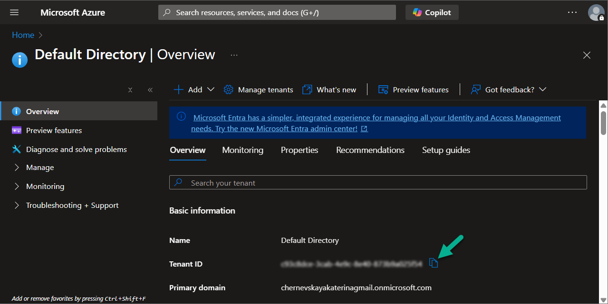
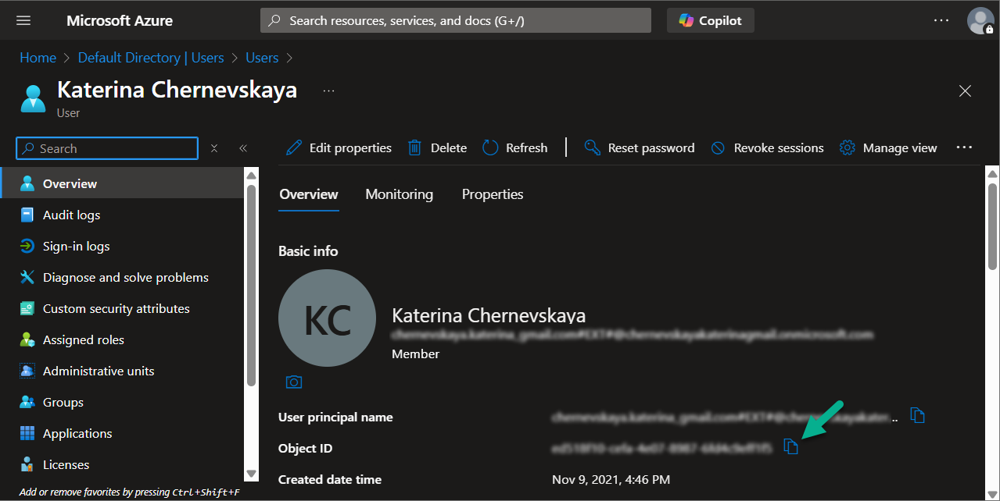
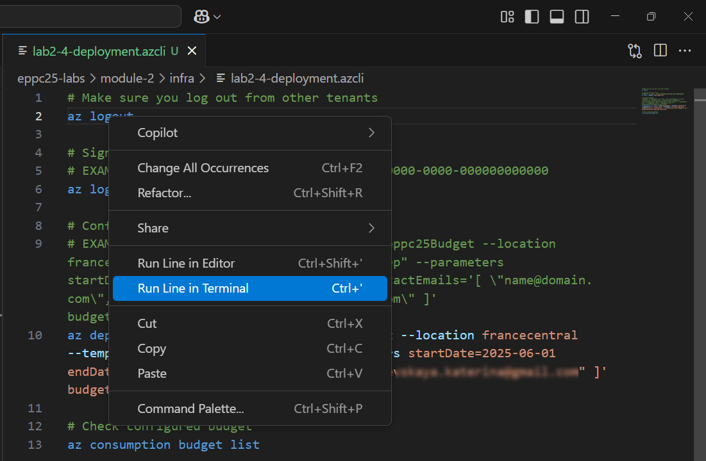

# Optional Lab 01: Deploy Azure resources with Bicep

*In this lab, you'll deploy the core Azure infrastructure required to support your AI agent solution. Using pre-written Bicep scripts, you will provision and configure a fully connected set of services, including AI Foundry, Azure OpenAI, Storage, Search, and monitoring components.*

*This automated deployment approach ensures that all services are not only created, but also securely integrated and ready to use in subsequent labs. You will also have the option to configure budget limits if supported by your subscription.*

*By the end of this lab, your environment will be fully prepared to ingest documents, run AI workloads, and monitor activity across the solution.*

## Prerequisites

To complete this lab, copy the following values:

- Tenant ID

    To get your **Tenant ID**, go to the [Azure Portal](https://portal.azure.com) and sign in with your credentials. Then navigate to **Microsoft Entra ID**, and copy the **Tenant ID** value from the overview page.

    

- Your user Principal ID

    To get you **Principal ID**, in the **Microsoft Entra ID** navigate to **Users** under the **Manage** section, select your user account and copy **Object ID** value.

    

***

## Deploy Core Azure Resources

> In this lab, you will use Bicep scripts to deploy the following Azure resources:
>   - Azure AI Foundry Hub
>   - Azure AI Foundry Project
>   - Azure Blob Storage
>   - Azure AI Search
>   - Azure OpenAI with two models: `gpt-4o` and `text-embedding-ada-002`
>   - Azure Monitor
>   - Azure Application Insights
>   - Azure Key Vault
>
> Additionally, the Bicep scripts will automatically configure all necessary connections and dependencies between the deployed resources, ensuring everything works together seamlessly.

1. Open the folder you cloned during [lab 0](../labs/lab-00-check-prerequisites/README.md) in VS Code. 

2. Navigate to `optional-prompt-flow-labs` folder. In the **infra** directory, open the file [deployment.azcli](./infra/deployment.azcli).

3. Open the **Terminal** in Visual Studio Code (shortcut: **Ctrl + `** or use top menu: **View -> Terminal**) and navigate to the **optional-prompt-flow-labs** folder by running the following command:

    ```
    cd <PATH_TO_THE_FOLDER>\optional-prompt-flow-labs
    ```

    > Replace `<PATH_TO_THE_FOLDER>` with your path (for example, `C:\fork\nordic-summit-25`).

4. Execute each command in the file **sequentially** using the integrated terminal.

    > 📝 To run each command, right-click on the specific line in the script and choose **Run Line in Terminal** from the context menu.
    >
    > Make sure that you installed **Azure CLI Tools** for VS Code.




