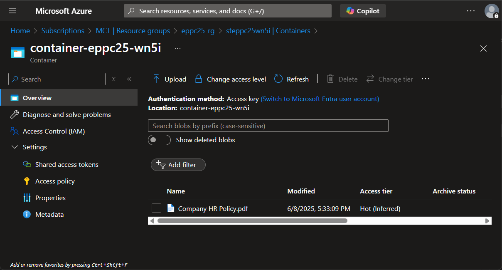

# Optional Lab 02: Upload documents to Blob Storage

*In this lab, you will upload a key document - **Company HR Policy.pdf** - to your Azure Storage Account. This file will serve as the knowledge source for your AI agent, enabling it to answer time-off related questions using generative answers grounded in actual company policy.*

1. Open the Storage Account you created in the previous lab. The resource name should look like: `stns25pf<CUSMON_SUFFIX>`.

2. Under the **Data storage** section, select **Containers**, then open the container that was created for uploading documents. The container name should be similar to: `container-ns25pf-<CUSMON_SUFFIX>`.

3. Click **Upload** to start the file upload process.

4. Add the [file](./data/Company%20HR%20Policy.pdf) provided in the **data** folder.

5. Click **Upload** again to confirm and begin uploading the file.

6. Once the upload is complete, you should see the file listed in the container:

    

