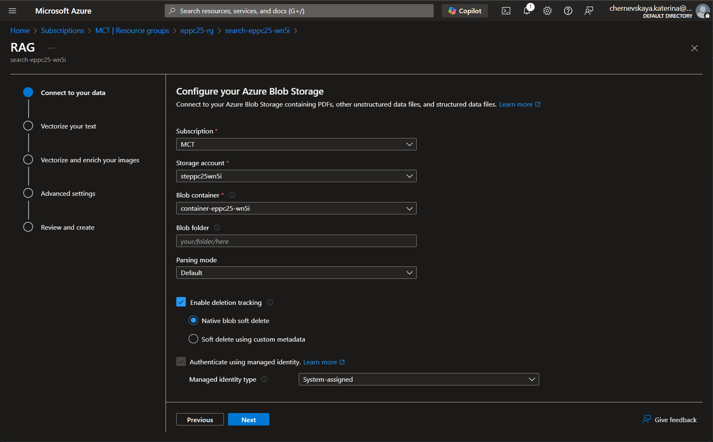
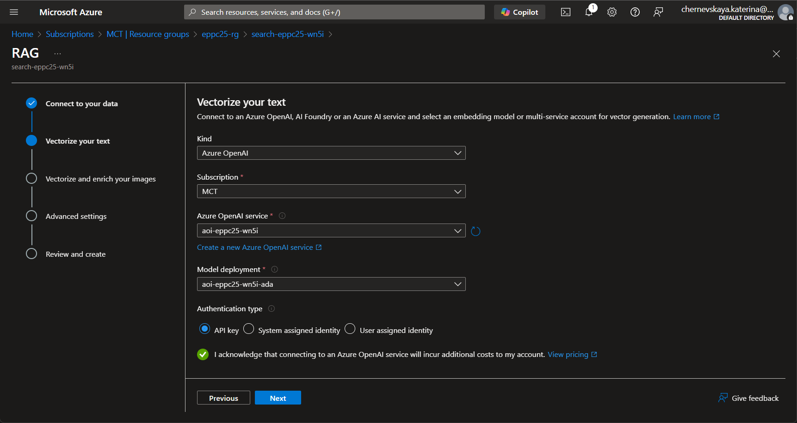
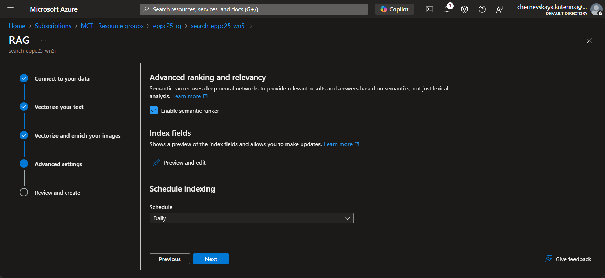
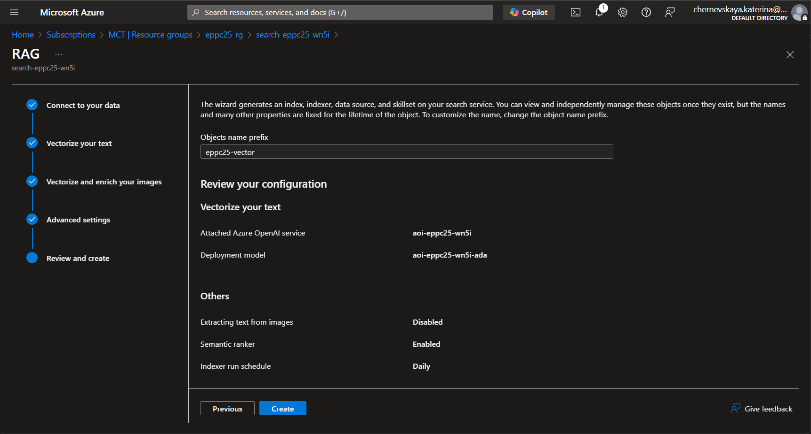
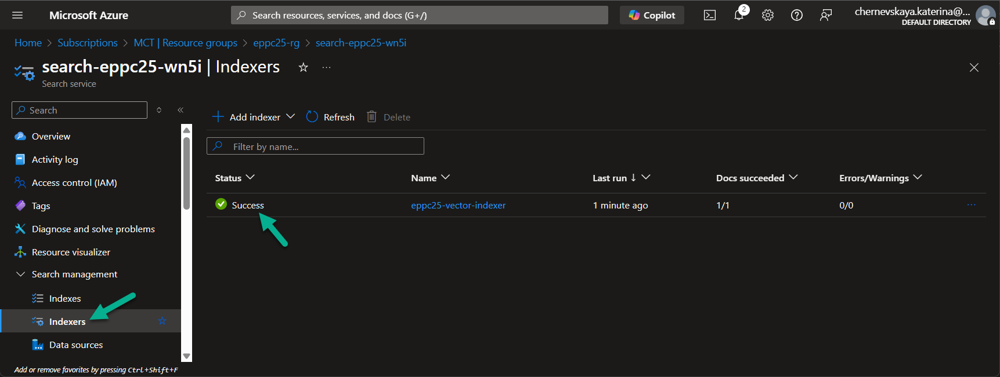

# Optional Lab 03: Configure search index

*In this lab, you’ll configure the key components of Azure AI Search to enable semantic and vector-based search capabilities. Using the built-in configuration wizard, you’ll define:*
- *Data Source – where the training documents are stored*
- *Indexer – to automatically extract and transform the data*
- *Index – the structure used for storing and retrieving information*
- *Vectorization – to power semantic search via embeddings from Azure OpenAI*

*This setups will enable your AI agent to perform more accurate and context-aware search queries based on your HR policy content.*

## Configure Index

1. Open the Azure AI Search resource you created in [Optional Lab 01](./optional-lab-01.md). The resource name should look like: `search-ns25pf-<CUSMON_SUFFIX>`

2. Click **Import and vectorize data** to launch the guided setup.

3. Select **Azure Blob Storage** datasource.

4. Select **RAG** scenario.

5. Configure data connection:
    - **Subscription:** Select your Azure subscription
    - **Storage account:** Select the Azure Blob Storage resource created in Lab 4
    - **Container:** Choose the container that contains your uploaded training dataset
    - **Parsing mode:** Default
    - **Enable the toggle:** Enable deletion tracking
    - **Enable the toggle:** Authenticate using managed identity

    

6. Click **Next**.

7. Configure Vectorization settings:
    - **Embedding service kind:** Azure OpenAI
    - **Subscription:** Select your Azure subscription
    - **Azure OpenAI resource:** Select the one created in Lab 4
    - **Model deployment:** Choose the ada model
    - **Check the box:**
        `I acknowledge that connecting to an Azure OpenAI service will incur additional costs to my account`

    

8. Click Next.

9. On the Advanced settings screen:
    - Set the Indexer schedule to **Daily**

    

10. Click **Next**.

11. On the **Review and create** screen in the **Object name prefix** field, enter: `ns25pf-vector`.

    

12. Click **Create** to deploy the data source, indexer, and index.

***

## Verify

1. Once the indexer has completed its first run, verify that the run finished successfully.

2. Ensure there are no warnings or errors.

    

3. Under the **Search management** section open the **Data sources** page and verify that the data source for this index has been created.

You are now ready to use vector-based search with your uploaded HR policy data.

