# Optional Lab 04: Import & update Prompt Flow

## Import the Prompt Flow

1. Open Azure AI Project resource and click **Launch studio**.

2. Under the **Build and customize** section select **Prompt Flow**.

3. On the Prompt Flow page select **+ Create** to create the first Prompt Flow.

   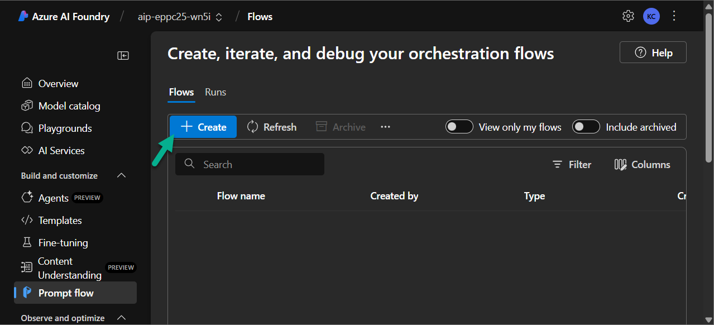

4. Scroll down to the **Import** section and click **Upload** under the **Upload from local** option.

   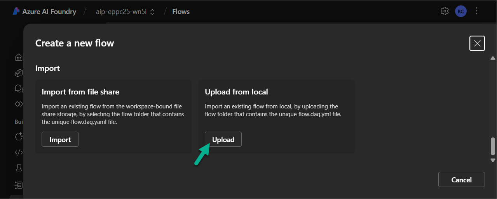

5. In the form:
   - Select **ZIP file** as the file type.
   - Click **Browse** and select the [ns25-promptflow.zip](./prompt-flow/ns25-promptflow.zip) file provided in the **prompt-flow** folder.
   - Enter a Prompt Flow name that will be visible in Azure AI Foundry (e.g., `ns25-promptflow`).
   - Set the Flow type to **Chat flow**.

6. Click **Upload** to complete the import.

   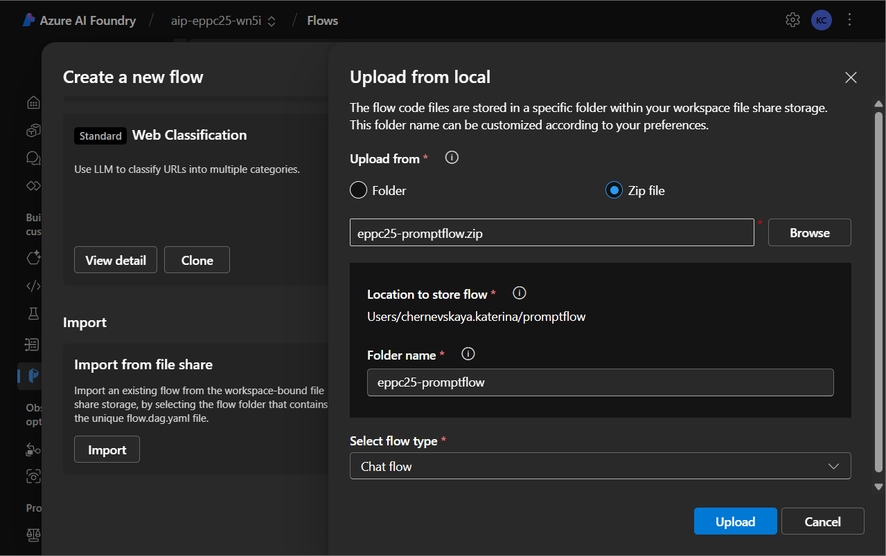

   > 📝 In some cases, when you create a brand-new Azure AI Foundry resource, the Prompt Flow may not fully upload on the first attempt. If you click the Upload button and the system initiates the upload but fails to complete it, you should rename the Prompt Flow before trying again.
   >
   >Don’t forget to change the name before the second attempt. Even if the initial import wasn’t successful, the system may have already partially registered the original name, which can cause conflicts on subsequent uploads.

***

## Run Compute Session

*A Compute Instance in Azure AI Foundry’s Prompt Flow is a dedicated virtual machine (VM) that provides the compute power necessary for tasks like evaluation, debugging, prompt engineering, and deployment. It allows you to interactively run flows or automate evaluation at scale, with flexible VM sizing and session management.*

1. In the Prompt Flow canvas, click the dropdown **Start compute session**.

2. Select **Start with advanced settings**.

   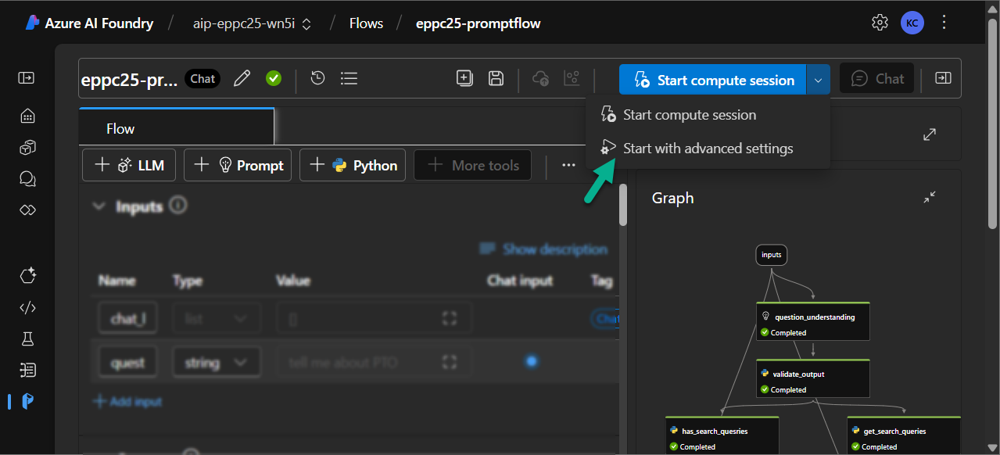

3. Configure your compute session:
   - **VM size:** Select a size appropriate for your workload (e.g., `Standard_D2as_v4`)
   - **Shutdown after:** Set this to `3 hour` to auto-terminate the session if idle

4. Click **Next** through the configuration screens.

5. On the final screen, click **Apply and start compute session**.

   > ⏳ Wait for the session to initialize. Once started, you’ll see a green indicator showing that the session is active and ready.

***

## Update the Prompt Flow

*In this step, you’ll connect your deployed resources from Lab 4 to the appropriate nodes in your Prompt Flow. This will enable the model to correctly interpret user queries, perform vector-based search, and generate grounded responses.*

1. Navigate to the `question_understanding` node. Update the following fields:
   - **Connection:** Select the Azure OpenAI connection you created in [Optional Lab 01](./optional-lab-01.md)
   - **deployment_name:** Select the name of the model deployment you configured in [Optional Lab 01](./optional-lab-01.md)

   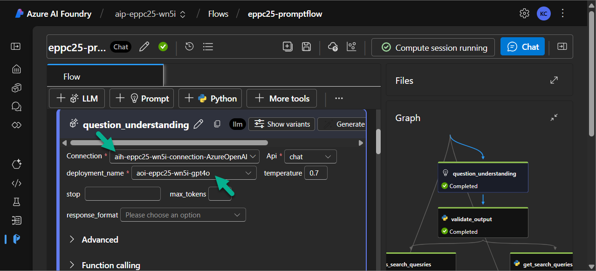

2. Repeat the same updates for the `answer_generation` node.

   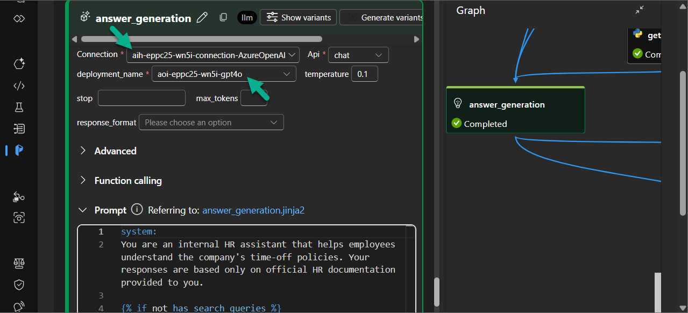

3. Navigate to the `chunks_search` node and click on the **mlindex_content** field to expand its configuration.

   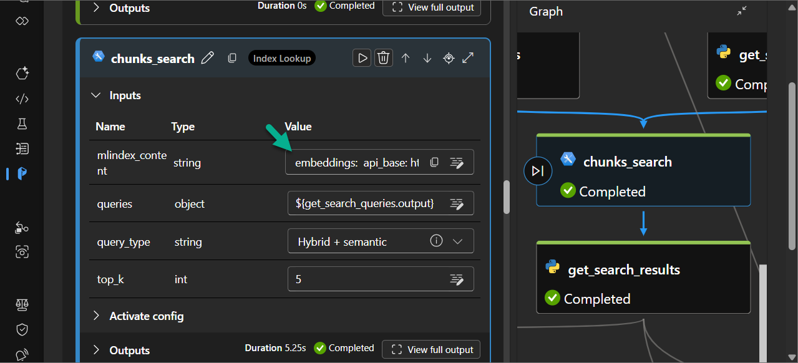

4. Update the following fields with the values associated with your Azure AI Search and embedding deployment:
   - **acs_index_connection:** Select your Azure AI Search connection
   - **acs_index_name:** Choose the index name (created during vectorization setup)
   - **semantic_configuration:** Select the appropriate semantic config if available
   - **aoai_embedding_connection:** Choose the connection to Azure OpenAI used for embeddings
   - **embedding_deployment:** Select the deployment name for the embedding model (ada)

   > 📝 Note: All values should appear in the dropdown menus if resources were correctly deployed in Lab 4.

   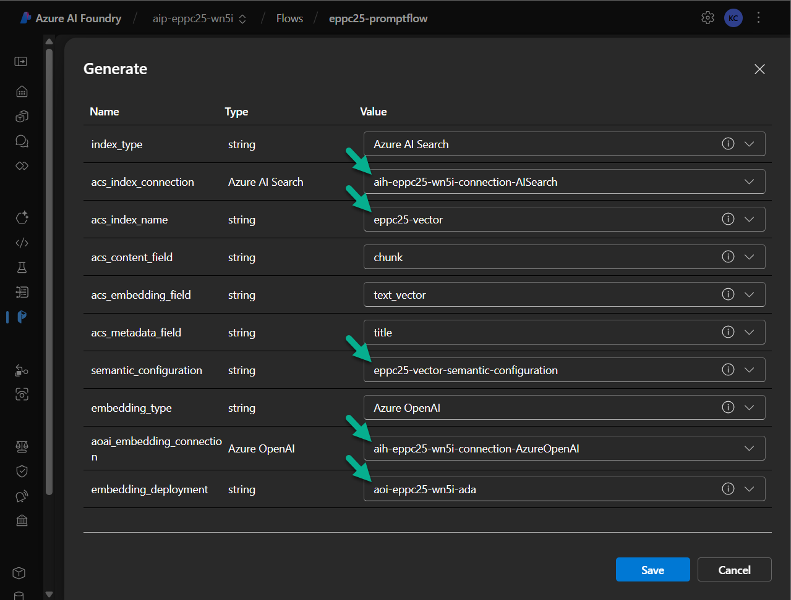

5. Navigate to `telemetry_log` node and update **connection_string** value with your Application Insights Connection String value. 

   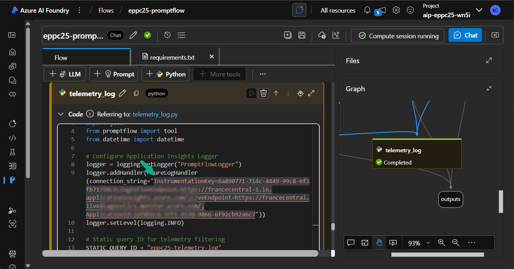

   > 💡 To get the Connection String value:
   >
   >- Open the **Azure Application Insights** resource deployed in [Optional Lab 01](./optional-lab-01.md). The resource name should look like: `appi-ns25pf-<CUSTOM_SUFFIX>`.
   >
   >- In the **Overview** tab, copy the **Connection String**.
   >
   >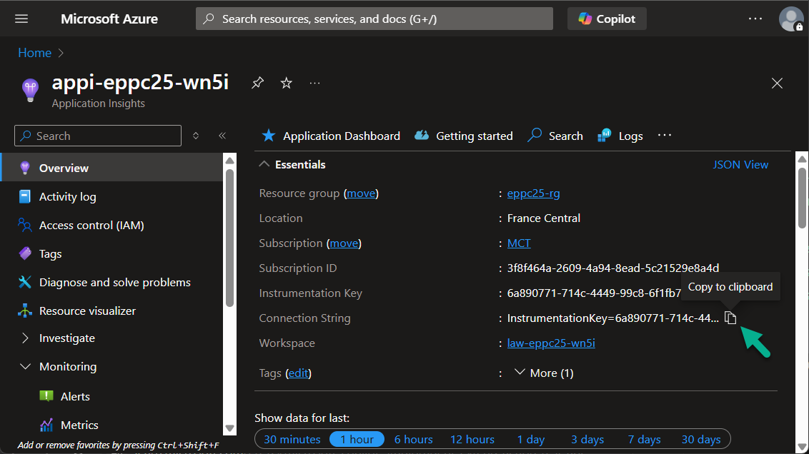

6. In the top panel of the Prompt Flow editor, click the **three-dot menu** and select **Raw file mode**.

   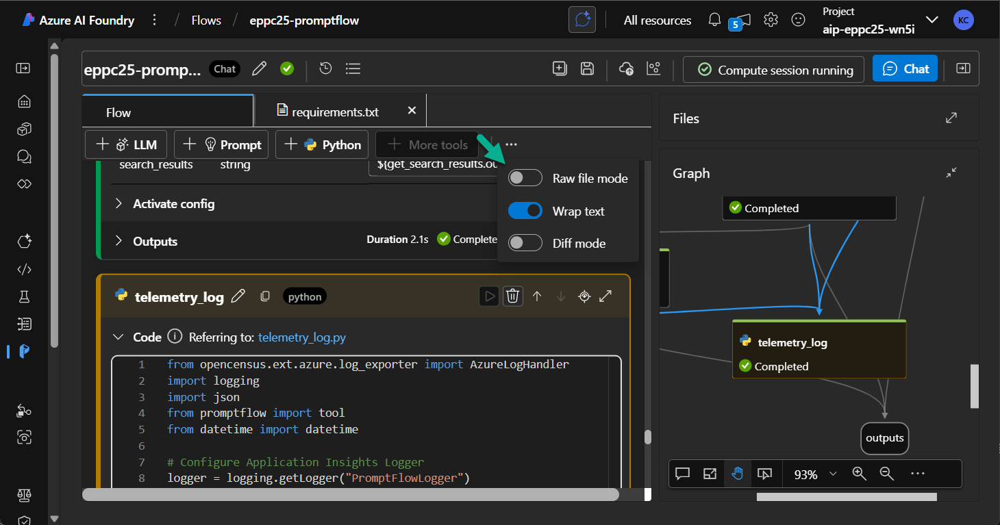

7. Append the following code at the end of the file:

   ```
   app_insights_enabled: true
   environment_variables:
     APPLICATIONINSIGHTS_CONNECTION_STRING: <YOUR_CONNECTION_STRING>
   ```

   > Replace `<YOUR_CONNECTION_STRING>` with your Connection String value
   >
   >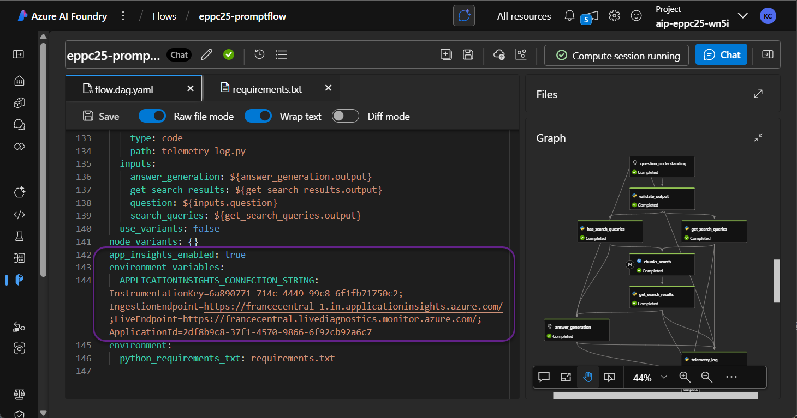

8. Click **Save** to apply changes.
