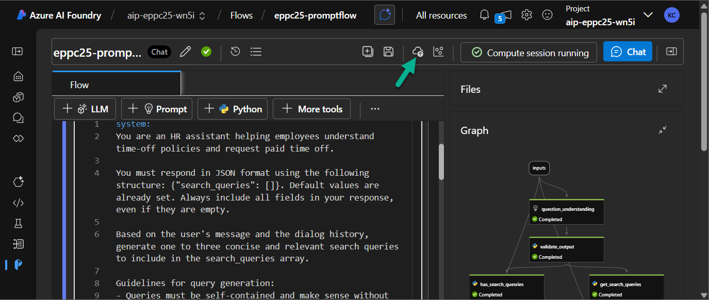
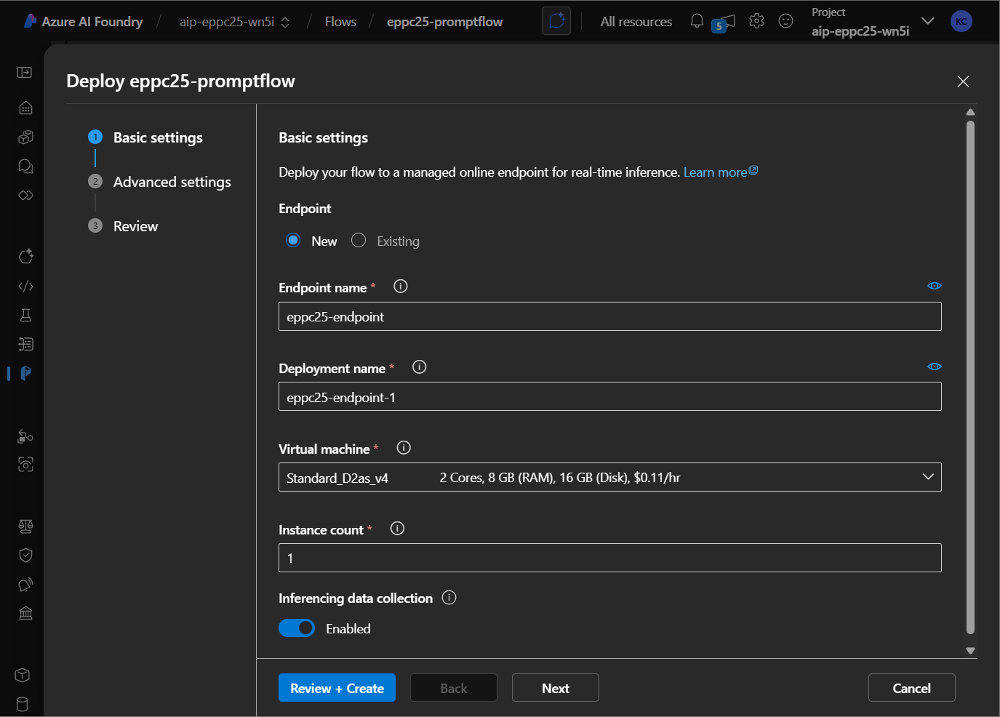
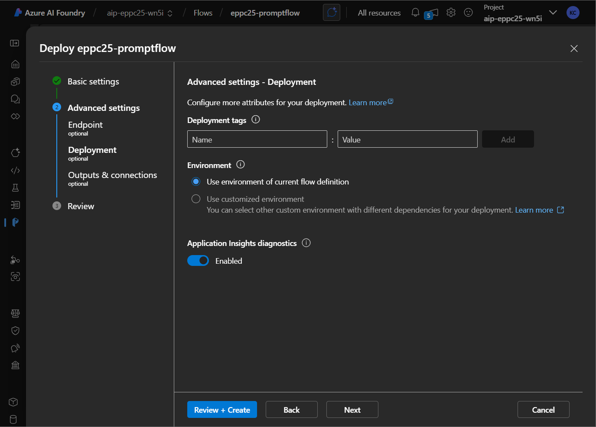
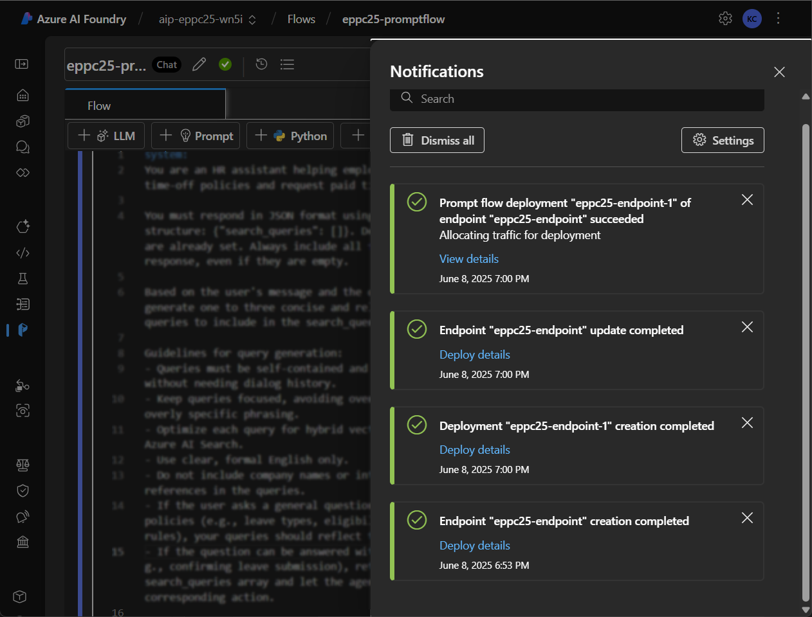

# Optional Lab 05: Deploy Prompt Flow as endpoint

*In this lab, you will deploy your Prompt Flow as a live endpoint to enable real-time interactions with external applications. Deploying an endpoint provides a RESTful interface that allows you to integrate the model into tools like chatbots, web apps, or automation workflows.*

*Deploying an endpoint also unlocks key production-grade features such as:*

🔍 *Monitoring (via Application Insights)*

🔐 *Secure key-based access*

🌐 *Scalability on-demand*

*By the end of this lab, your flow will be accessible via a secure API and testable through tools like Postman.*

## Deploy the Endpoint

> 📝 Pre-check: Make sure the compute session is running. If not, start it before proceeding.

1. Open your Prompt Flow in Azure AI Foundry.

2. Click the **Deploy** button.

   

3. Fill in the deployment form:

    **Basic Settings:**

    - Enter the **Endpoint** name (e.g. `ns25pf-endpoint`) and **Deployment** name (e.g. `ns25pf-endpoint-1`)

        > You can create multiple deployments for a single endpoint. However, ensure that you have sufficient virtual machine (VM) quota allocated to support them.
        > 
        > 📝 Note: 20% of your compute resources will be automatically reserve to handle upgrades for certain VM types.
        > 
        > For example, if your deployment requires 10 VM instances, you must have a quota that allows for at least 12 instances. This buffer ensures availability during platform-managed upgrades and applies per VM SKU and core type.

    - Choose the compute type (for workshop purposes, select the cheapest available VM - for example `Standard_D2as_v4`)

        

    **Endpoint Settings:**

    - Leave default values as-is
    - (Optional) Add tags for easier identification

    **Deployment Settings:**

    - Enable **Application Insights diagnostics**
    - (Optional) Add tags

    

    **Outputs & Connections:**

    - Ensure all required parameters are correctly pre-filled

4. On the final page, click **Create** to start provisioning the endpoint.

    > ⏳ Provisioning may take several minutes. Once completed, the interface will show a confirmation.

    

