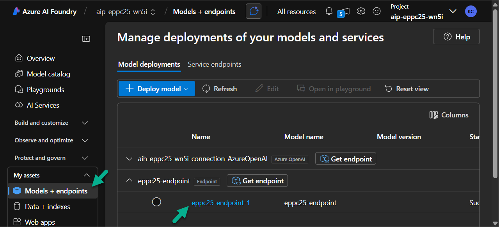
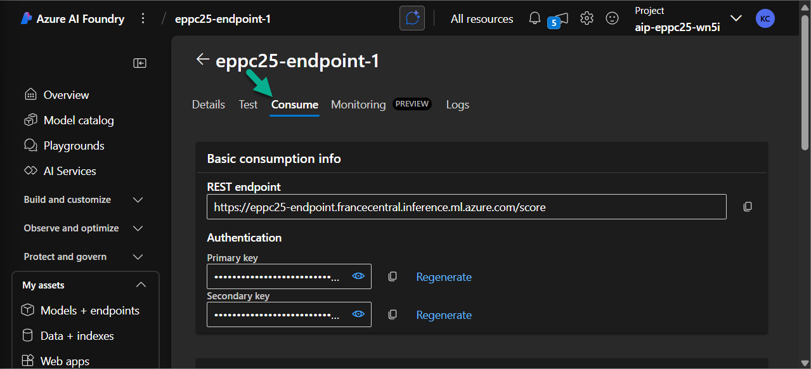
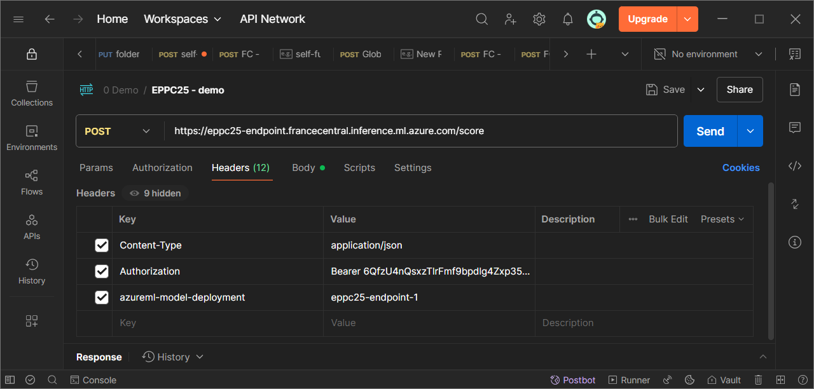
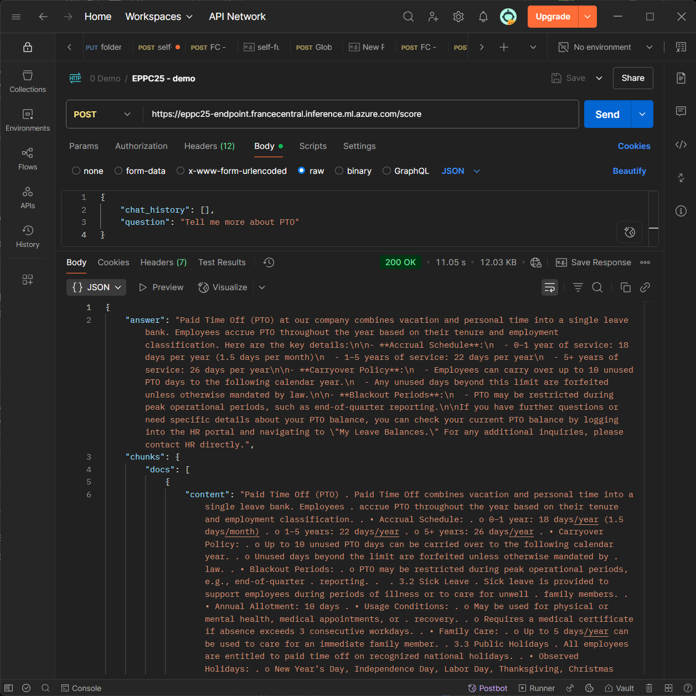

# Optional Lab 06: Test the endpoint using Postman

*Once the endpoint is live, you can test it using Postman.*

1. In Azure AI Studio, go to the **Models + endpoint** section and open the one you just created.

    

2. Navigate to the **Consume** tab to find the API details.

    

3. Open **Postman** and create a new request with the following settings:

    - **Method:** POST
    - **URL:** Copy the value from the **REST endpoint** field
    - **Headers:**

        | Parameter | Value |
        |--|--|
        | Content-Type | application/json |
        | Authorization | Bearer `<YOUR_KEY>` |
        | azureml-model-deployment | `<YOUR_MODEL_NAME>` |

        > `<YOUR_KEY>` → Copy from **Primary Key**
        > `<YOUR_MODEL_NAME>` → Copy from the **Deployment Name**

        

    - **Body:**
    
        - Switch to **raw** and select **JSON** format.
        - Paste the following test payload:

        ```
        {
            "history": [],
            "question": "Tell me more about PTO"
        }
        ```

        

4. Click **Send** to execute the request.

5. You should receive a response from the Prompt Flow with a relevant answer.

    


