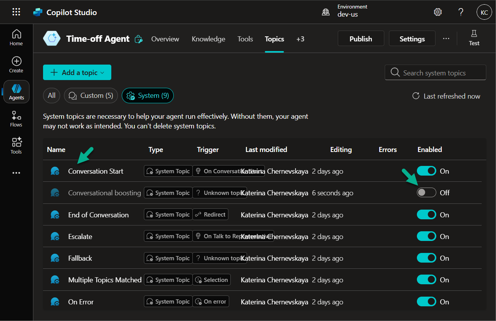
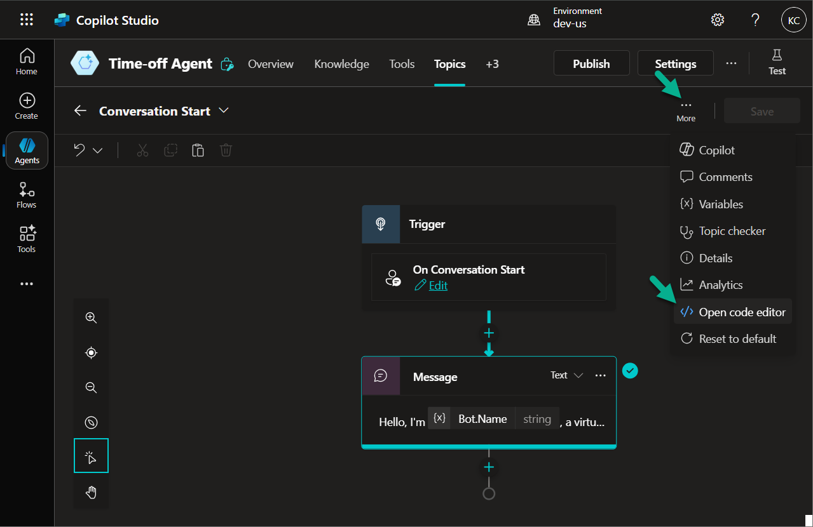
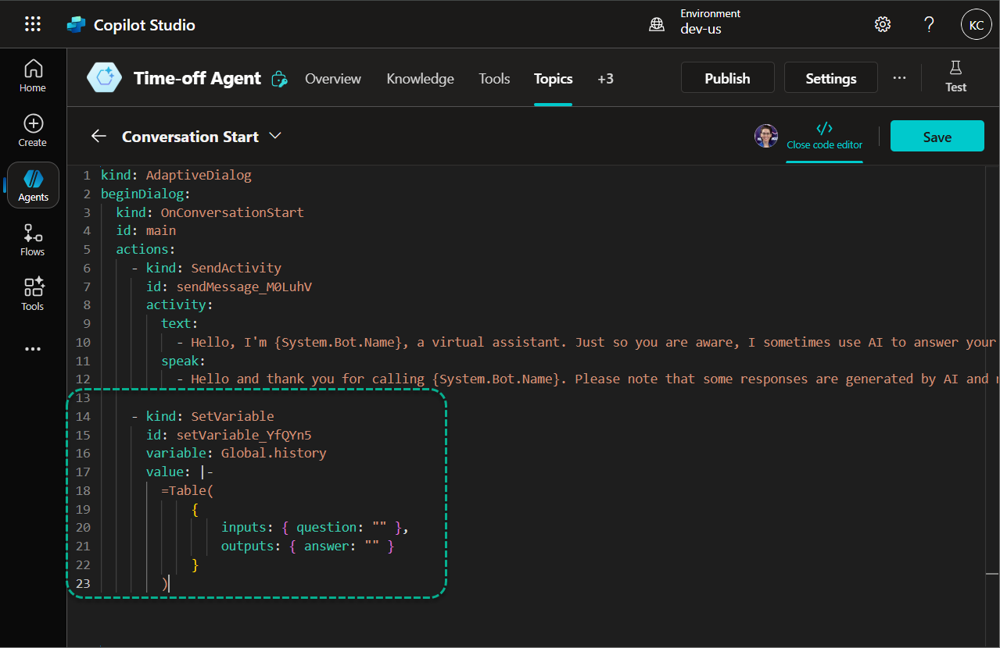
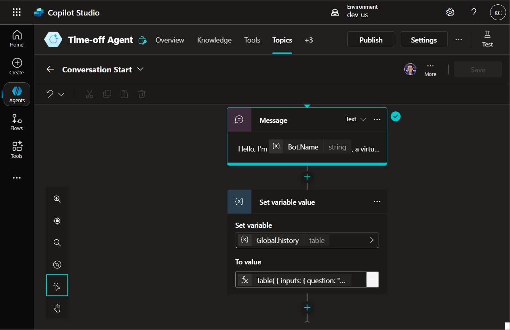
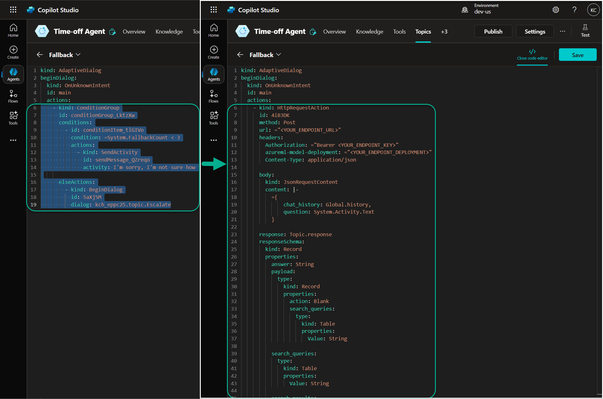
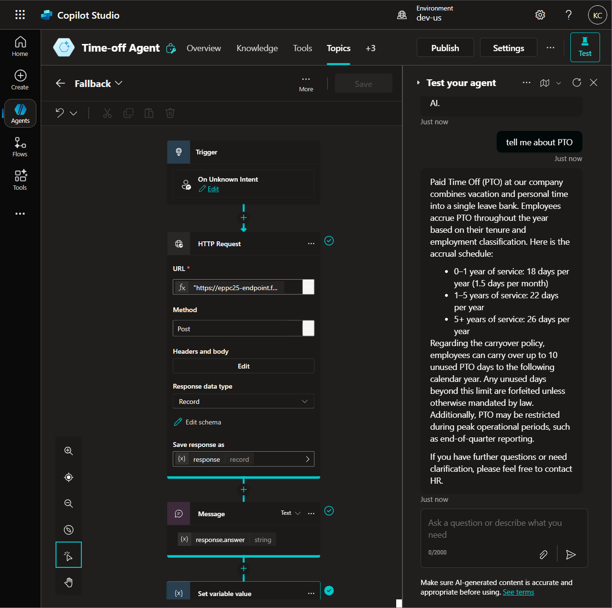

# Optional Lab 07: Connect the Prompt Flow endpoint to Copilot Studio

*In this lab, you will prepare your Copilot Studio agent to work with the Prompt Flow endpoint by adjusting conversation logic and initializing the required variables. This ensures the agent maintains conversation history when interacting with the flow.*

## Initiate the History array

1. Open your **Agent** in **Copilot Studio**.

2. Navigate to the **Topic** section.

3. Disable the **Conversational boosting** topic, and open the **Conversation Start** topic.

   

4. Click the three-dot menu and select **Open code editor**.

   

5. Scroll to the end of the YAML file and add the following block of code:

    ```

            - kind: SetVariable
                id: setVariable_YfQYn5
                variable: Global.history
                value: |-
                    =Table(
                        { 
                            inputs: { question: "" }, 
                            outputs: { answer: "" } 
                        }
                    )
    ```

    > ⚠️ Important:
    > 
    > – Add an empty line between this block and the previous one
    >
    > – Ensure the indentation is consistent (use 2 spaces)

    

6. Click **Save** to apply the changes.

7. After saving, you will see a new action added: **Set variable value**, which initializes an empty conversation history array.

    

***

## Update Fallback topic

1. Open the **Fallback** topic in your Copilot Studio agent.

2. Click the **three-dot menu** and select **Open code editor**.

3. Replace the entire set of actions with the following code:

```
    - kind: HttpRequestAction
      id: 4iB3DK
      method: Post
      url: ="<YOUR_ENDPOINT_URL>"
      headers:
        Authorization: ="Bearer <YOUR_ENDPOINT_KEY>"
        azureml-model-deployment: ="<YOUR_ENDPOINT_DEPLOYMENT>"
        Content-Type: application/json

      body:
        kind: JsonRequestContent
        content: |-
          ={
              chat_history: Global.history,
              question: System.Activity.Text
          }

      response: Topic.response
      responseSchema:
        kind: Record
        properties:
          answer: String
          chunks:
            type:
              kind: Record
              properties:
                docs:
                  type:
                    kind: Table
                    properties:
                      content: String
                      doc_id: String
                      original_score: Number
                      reranked_score: Blank
                      source: String

                links: String
                queries:
                  type:
                    kind: Table

          search_queries:
            type:
              kind: Table
              properties:
                Value: String

    - kind: SendActivity
      id: sendActivity_LKvOem
      activity: "{Topic.response.answer}"

    - kind: SetVariable
      id: setVariable_UmwtiG
      variable: Global.history
      value: |-
        =Table(
            Global.history,
            {
                inputs: { question: System.Activity.Text },
                outputs: { answer: Topic.response.answer }
            }
        )
```
  


4. Replace the following placeholders with your actual values:

   - `<YOUR_ENDPOINT_URL>` - Your Prompt Flow endpoint URL
   - `<YOUR_ENDPOINT_KEY>` - Primary key for authorization
   - `<YOUR_ENDPOINT_DEPLOYMENT>`
   - Name of your deployed model

5. Click **Save** to apply the changes.

***

## Test the Topic

1. Open the **Test** pane on the right-hand side of the Copilot Studio editor.

2. Send a message to the agent, for example: `tell me about PTO`.

3. You should receive a response generated by the Prompt Flow endpoint, based on the HR policy document.

   

4. Open the **Variables** panel and switch to the **Test** tab. Locate the **response** topic variable and expand it to view all outputs returned from the Prompt Flow.
This includes the generated answer, any search queries, and retrieved documents if available.

   
