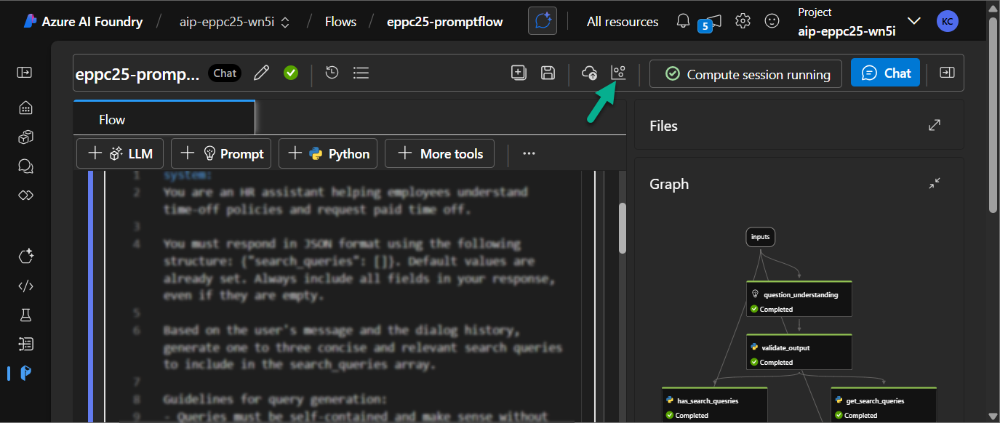
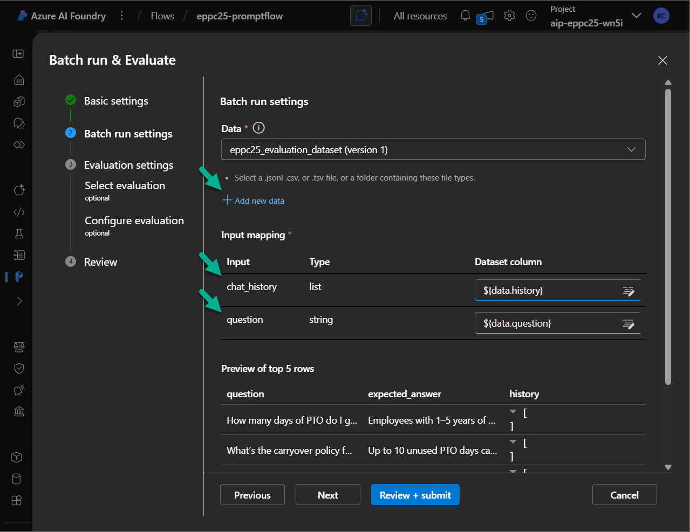
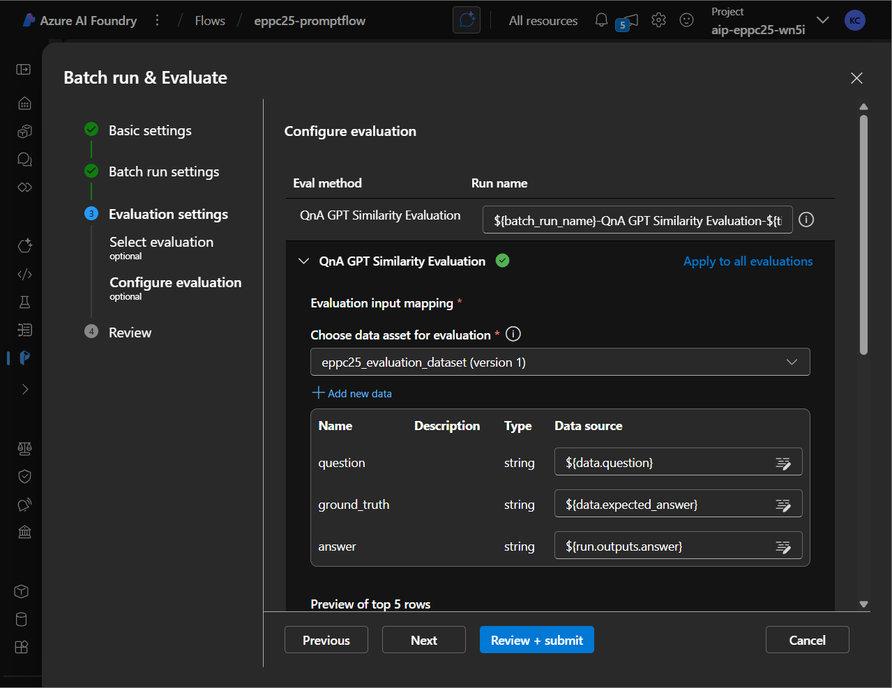
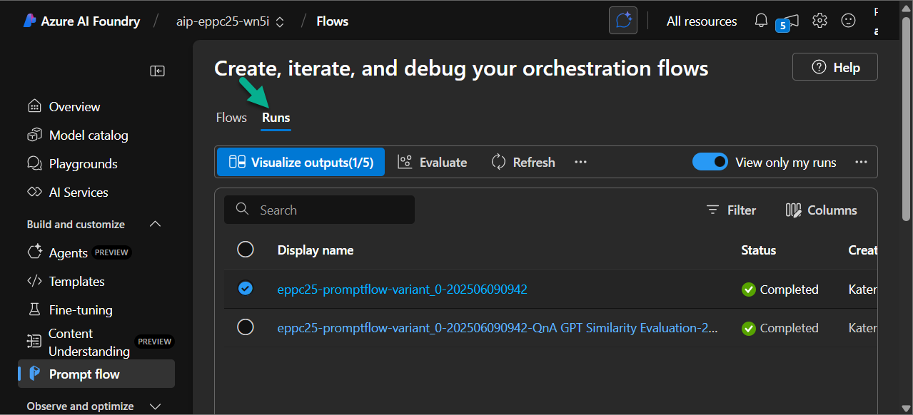
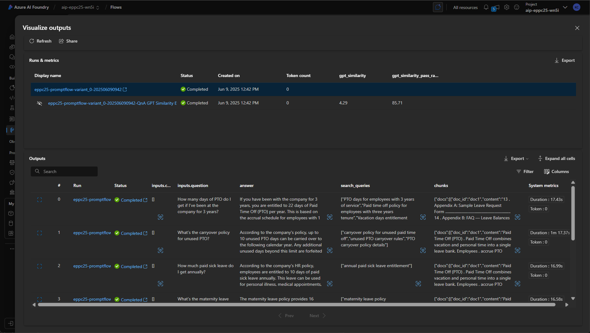
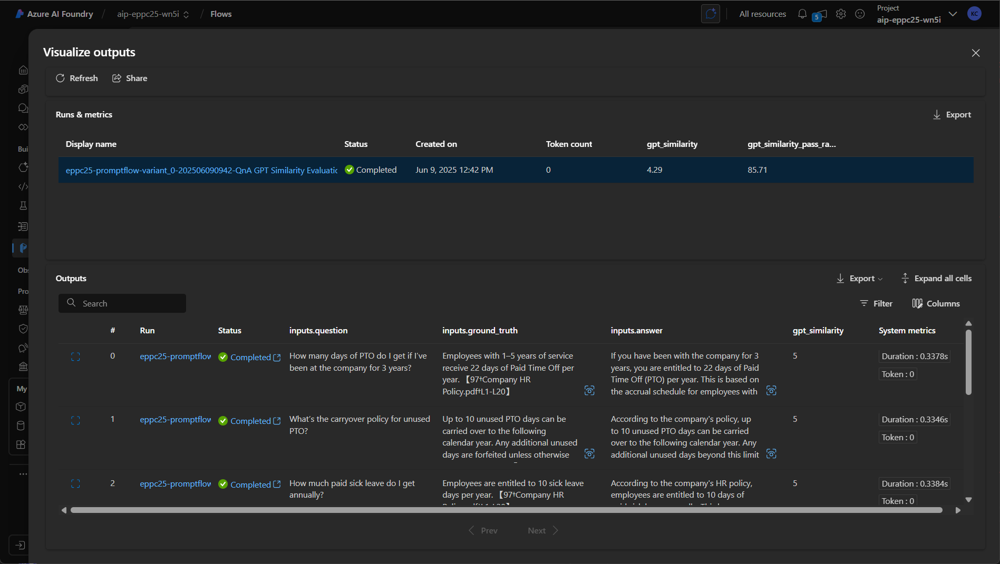

# Optional Lab 08: Evaluate the Prompt Flow (metrics, variants)

## Run Evaluation for Prompt Flow

*In this lab, you will run a custom evaluation on your Prompt Flow to assess its performance using a prepared test dataset. You’ll upload a .jsonl file, map inputs and expected outputs, and use the built-in QnA GPT Similarity Evaluation metric to evaluate answer quality.*

1. Open **Azure AI Foundry** and navigate to your **Prompt Flow**.

2. Ensure that the **Compute instance** is running. If not, start it as you did before.

3. Click the **Evaluate the performance of the flow** button and select **Custom evaluation** from the dropdown.

    

4. On the **Basic settings** screen, keep the default values and click **Next**.

5. On the **Batch run settings** screen, click **+ Add new data**.

    In the opened window:

    - Enter a **Dataset name,** e.g., `eppc25_evaluation_dataset`
    - Select **Upload from local folder**
    - Click **Browse** and upload the file [evaluation-dataset.jsonl](./evaluation-dataset/evaluation-dataset.jsonl) from the **evaluation-dataset** folder
    - Click **Add** to attach the dataset

6. In the **Input mapping** section:

    - Map **chat_history** to `${data.history}`
    - Map **question** to `${data.question}`

    

7. Click **Next**.

8. On the **Select evaluation** screen:

    - Choose **QnA GPT Similarity Evaluation** as the evaluation method
    - Click **Next**

9. On the **Configure evaluation** screen:

    - Ensure the correct dataset is selected in **Choose data asset for evaluation**
    - Map the fields as follows:

        - **question** → `${data.question}`
        - **ground_truth** → `${data.expected_answer}`
        - **answer** → `${run.output.answer}`

        

    - Under **Connection**, select the appropriate Azure OpenAI **Connection** and **Deployment name / Model**

10. Click **Next** to continue.

11. On the **Review** screen, verify all settings and click **Submit** to start the evaluation run.

***

## Explore Evaluation results

*After running the evaluation, you can explore both raw Prompt Flow outputs and the results of the similarity-based scoring. This step will help you understand how well your flow performs and what kind of responses it generates.*

1. Open **Azure AI Foundry** and go to the **Prompt Flow** section.

2. Navigate to the **Runs** tab.

3. Select the first run (the one without the `QnA GPT Similarity` suffix) and click the **Visualize outputs** button.

    

4. On the **Visualize Output** screen, you can explore:

    - The generated answers from the Prompt Flow
    - Extracted search queries and retrieved chunks
    - Basic system metrics

    

5. Close the visualization pop-up, then select the second run (the one with the `QnA GPT Similarity` suffix).

6. Click **Visualize outputs** again.

7. This time, the **Visualize Output** view will include:

    - The Prompt Flow's answer
    - The expected (ground truth) answer
    - The similarity score, which reflects how closely the generated answer matches the expected one

    
